# 传统开发和 ng 以及 vue 的区别概述

## 传统开发

传统的 web 开发经历了好几个阶段
- 静态网站阶段
- 后台渲染动态网站阶段
- ajax 阶段( 前后台半分离阶段 )
- 前后分离阶段

### 静态网站阶段

早期的网络只是为了通信, 传递信息. 是专有网络. 所以也不存在信息身份验证等内容. 
仅仅使用静态网站展示需要显示的文字信息. 但是随着网络发展越来越快, 
静态网站已经不再满足现在的需求. 例如, 无法实现搜索, 登录等模型.

### 后台渲染动态网站阶段

为了实现动态网站, 需要将很多逻辑在服务器生成, 然后在根据需要生成相应的 HTML 页面( HTML 字符串 ).
然后由服务器返回给浏览器, 用户再查看页面. 

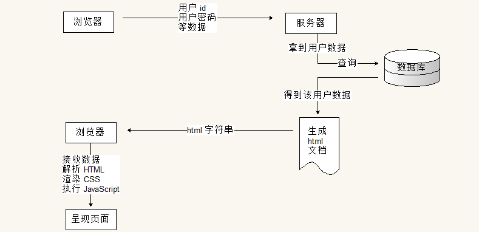

但是该模型使得每次索要数据都会进行一次请求与响应过程. 而浏览器只有使用 form, 表单提交来实现该功能.
那么就会造成一个较为不友好的方式: 页面重新加载. 试想一下, 在看到好电影时, 想要发表一个评论, 
提交后页面重新加载 ... 然后再等一分钟广告?

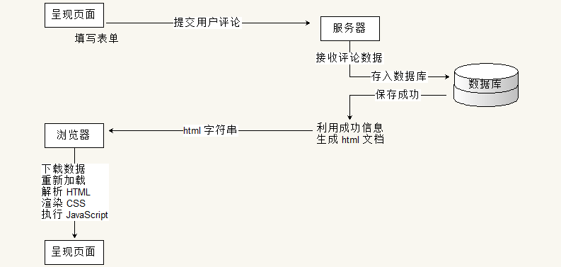

### ajax 阶段( 前后台半分离阶段 )

为了提高用户体验(在接收数据的时候, 浏览器不进行重新加载页面), Ajax 技术不断的被使用.
异步的提交请求, 不影响页面的正常显示与运行. 然后请求被服务器处理, 响应回来后触发一个回调函数,
在回调函数中利用 DOM 操作对页面进行处理.

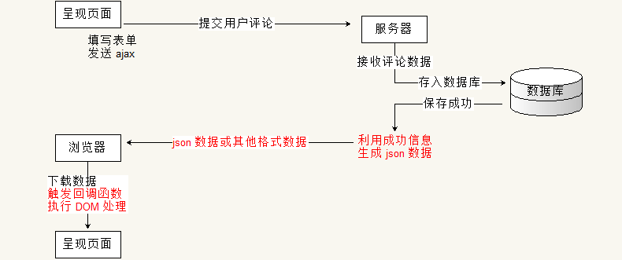

随着移动端的慢慢兴起, 需要配合多个尺寸的客户端, 同时需要移动设备开启时有较好的用户体验, 
慢慢的需要将全台渲染完全从后台移到前台. 

- 传统后台提供数据与界面的代码, 因此分离后后台只需要提供数据, 将面渲染的行为交给前端(浏览器). 这样不仅降低了服务器压力, 也使得适配变得容易.
- 将界面的处理交给浏览器. 在移动设备上, 浏览器可以保存一部分数据. 在启动 app 的时候, 可以展示上次关闭时的界面, 同时异步请求最新数据.待请求数据返回后更新界面. 从而不会出现页面加载时的白屏, 提升用户体验.


### 前后分离阶段

前后分离是 web 开发的趋势. 将所有的界面交互与应用交给浏览器执行, 所有的数据加载都使用 ajax 异步请求. 第一次请求一个界面的外壳, 或许带有少量数据. 然后在使用过程中不断按需请求数据, 加载数据. 从而诞生单页面应用程序. 将整个 web 看成一个独立的 app.

将前端独立出来后, 诞生出大量前端框架, 提供一整个生态系统. 对于前端开发者, 重心可以更加专注与用户与界面.


## 传统开发与 angular 和 vue 的直观对比

angular 与 vue 属于一类框架( 也可以简单的称之为库, 解决方案等 ), 都属于 MV* 系列框架.
利用面向对象的方式去封装界面中的各种功能( 组件或模块 ). 

传统的页面操作( jQuery 时代 )是站在 DOM 模型的基础上, 将 html, 原本一个结构化字符串, 看成一棵对象树.
利用提供的 DOM 方法对树中的各个节点( node 节点 )进行增加节点, 删除节点, 修改节点属性或样式, 以及查询指定节点等操作.
从而实现界面的交互. 

例如目录展开, 利用的是点击事件加修改元素的 `display` 样式.

```javascript
var a_list = document.querySelectorAll( '.menu-title' );
Array.prototype.slice.call( a_list ).forEach(elem => {
    elem.onclick = function () {
        var ul = this.nextSibling.nextSibling;
        var classNames = ul.className.split( ' ' );
        var i = -1;
        if ( ( i = classNames.indexOf( 'hide' ) ) > -1 ) {
            classNames.splice( i, 1 );
        } else {
            classNames.push( 'hide' );
        }
        ul.className = classNames.join( ' ' );
    }
});
```

虽然传统的 DOM 操作也是在使用 面向对象. 但是其颗粒度非常的细. 它将每一个标签都看成对象, 所以对于较大的代码逻辑, 
实际操作起来依旧会很麻烦. 但是如果使用 MV* 的框架, 将整个逻辑单元看成对象( 一个对象中可能包含很多标签 ). 
例如还是以菜单为案例, 在 angular 或 vue 中, 可以将整个菜单看成对象. 而其中利用数据驱动界面这一特征, 
使得上述代码实现起来极为简单.

例如在 vue 中, html 部分( 片段 )为:

```html
<ul>
    <li id="app1"><a class="menu-title" v-on:click="myclick">一级菜单1</a>
        <ul v-show="ishide">
            <li>二级菜单1.1</li>
            <li>二级菜单1.2</li>
        </ul>
    </li>
    <li id="app2"><a class="menu-title" v-on:click="show = !show">一级菜单2</a>
        <ul v-show="show">
            <li>二级菜单2.1</li>
            <li>二级菜单2.2</li>
        </ul>
    </li>
</ul>
```

其代码为:

```javascript
new Vue({
    el: '#app1',
    data: {
        ishide: false
    },
    methods: {
        myclick: function () {
            this.ishide = !this.ishide;
        }
    }
});

new Vue({
    el: '#app2',
    data: {
        show: false
    }
});
```

angular 的实现更有意思, 可以不写一句 js 代码:

```html
<div ng-app ng-init="menu1 = menu2 = menu3 = false">
    <ul>
        <li><a class="menu-title" ng-click="menu1 = !menu1">一级菜单1</a>
            <ul ng-show="menu1">
                <li>二级菜单1.1</li>
                <li>二级菜单1.2</li>
            </ul>
        </li>
        <li><a class="menu-title" ng-click="menu2 = !menu2">一级菜单2</a>
            <ul ng-show="menu2">
                <li>二级菜单2.1</li>
                <li>二级菜单2.2</li>
            </ul>
        </li>
        <li><a class="menu-title" ng-click="menu3 = !menu3">一级菜单3</a>
            <ul ng-show="menu3">
                <li>二级菜单3.1</li>
                <li>二级菜单3.2</li>
            </ul>
        </li>
    </ul>
</div>
```

注意: 这里的代码逻辑可能让部分初学者不知所云, 这里不用担心, 后面我们会详细的加以说明.


在 MV* 框架中, 将整个菜单看成一个对象.在 angular 中( 由于该讲义为 ng 基础讲义, 这里用 angular 做说明 ), 
这个对象的显示范围由 `ng-app` 来标记, 凡是 `ng-app` 包含的范围都属于该对象所维护的区域. 

同时在 该对象中维护了三个属性, 分别是 `menu1`, `menu2`, 以及 `menu3`. 
在代码中使用 `ng-init` 将这三个变量初始化为 `false`. 实际上这个 `ng-init` 可以省略.

同时在这个对象中, 使用 `ng-click` 注册了三个点击事件, 在点击事件中, 对对应的变量取反. 即 `true` 变成 `false`,
而 `false` 变成 `true`. 

另外在子菜单上使用 `ng-show` 来根据对应的 变量 来控制当前标签是否显示.

如此, 只要点击对应的 `a` 标签, 就会触发相应的 `click` 事件, 即会将对应的 `menu` 变量取反.
同时由于对应的变量发生变化, 会随之将子菜单( 含有 `ng-show` 的标签 )的显示情况进行修改. 
如果变量为 `true` 则显示; 若变量为 `false` 则隐藏.


## MVVM 开发模型简述

angular 是一个 MVVM 的框架, 这里第一个 M 是 Model, 即模型, 是表示数据模型的含义. 
这里的第二个字符 V 是 View, 表示视图, 即用于显示的界面. 它一般是一个模板, 套用数据后就可以得到想要的显示.
接下来的 VM 是 ViewModel, 即视图模型. 用于联系视图与数据模型的桥梁. 一般用于控制显示. 

在 MV* 系列的概念中, 存在诸多争议, 实际上这些争议都是仁者见仁智者见智. 初学者不需要深究 MVC 还是 MVVM.
建立好操作模型比较重要. 

在 传统的 DOM 操作中, 重点在造作页面的步骤. 

- 找出需求, 抽象出数据模型.
- 然后确定需要处理什么元素, 接着找到该元素.
- 然后确定算法, 按照算法一步步操作元素.
- 最后再来决定是否需要优化.

也就是说, 传统的做法, 即使是使用 DOM 对象, 但是将重点依旧放在了处理步骤上, 还是采用的过程化思维.


而 MVVM 则不同, 它完全采用面向对象的思想. ng 中将需要处理的页面( `ng-app` 标记的标签 )看成一个模块( module, 
初学者直接将其与对象可以等同 ), 然后在模块中抽象出数据模型. 并在界面中使用各种指令( directive )来关联背后的对象.
angular 框架帮我们完成了关联与联动的任务, 我们不用关系其具体的实现. 
在使用 angular 框架后, 原本要操作界面 dom 的步骤转而变成操作背后的对象, 我们修改对象的属性或成员. angular 帮我们将这个修改作用到页面的 DOM 上, 从而实现: *操作背后的对象, 即操作界面的元素*. 

例如代码逻辑:

html 部分:

```html
<div ng-app="app">
    <input type="text" ng-model="txt" />
</div>
```

js 部分:

```javascript
angular.module( 'app', [] )
    .run(function ( $rootScope ) {
        $rootScope.txt = 'angular';
    });
```


使用 angular 后, 操作模型就变成下面的逻辑关系:

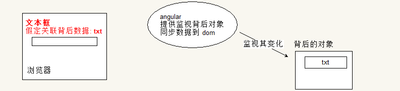

我们操作背后对象的 `text` 属性

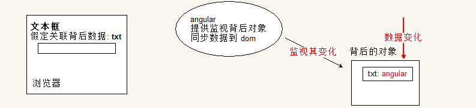

会通知处于实时监视背后对象的 angular

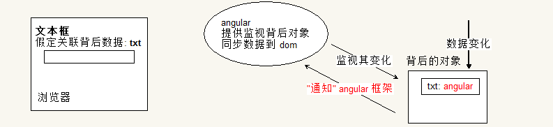

然后 angular 会将数据的改变同步到界面中的对应位置

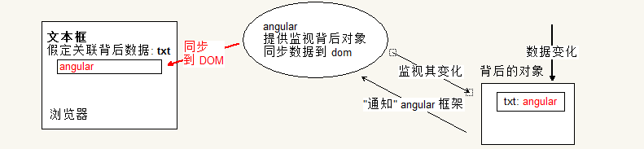

从而实现了操作对象, 然后对象帮我们操作页面这一逻辑. 


同时 angular 还提供了将界面的操作同步到背后的对象上的逻辑. 依旧采用该这个模型. 

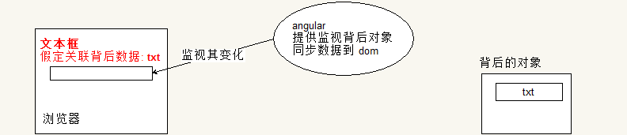

在我们修改界面的数据后会触发 angular 的监听行为

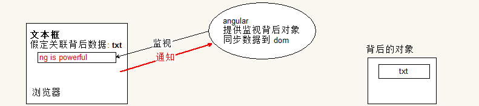

从而将数据同步到背后的对象中. 以该代码为例, 背后的对象就是 `$rootScope`

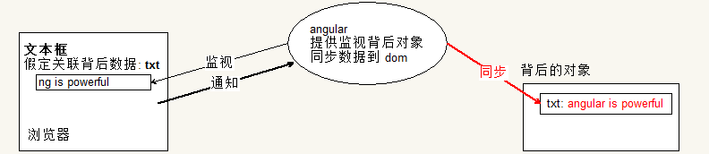

这样就可以实现: 取页面中元素的数据, 可以直接从背后的对象上取得, 不需要处理 dom.


最终如果要验证, 我们可以将 `$rootScope` 映射到全局对象上来查看:

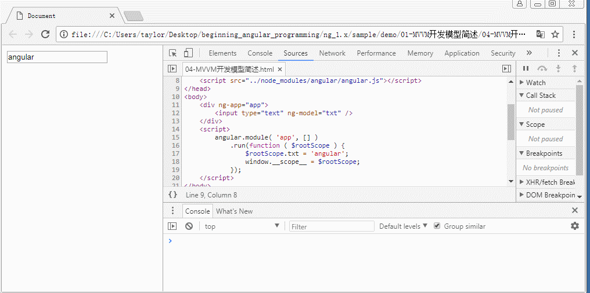

注意: 由于将 `$rootScope` 放到了 ng 结构的外部, 所以在数据修改后需要手动调用一个 `$apply()` 方法. 如果是在 ng 代码结构的内部就不需要. 这里的细节可以先暂时不考虑, 重点是思想, 代码编写思维的变化.


## 小结

本节我们讨论了传统开发与使用 angular 开发的区别. 
- 传统开发注重细节
- angular 是 MVVM 的框架, 将直接操作 DOM 转变成操作 对象, 而 ng 将这个操作同步到界面中
- 同时 ng 还提供将界面数据的修改同步到背后的对象上, 使得我们需要获得页面的数据, 可以直接从对象上取得.

同时抽象出来 MVVM 的模型图, 该图现在也许会对部分同学造成困惑, 可以先记住它, 在后续的代码中慢慢体会其意义:

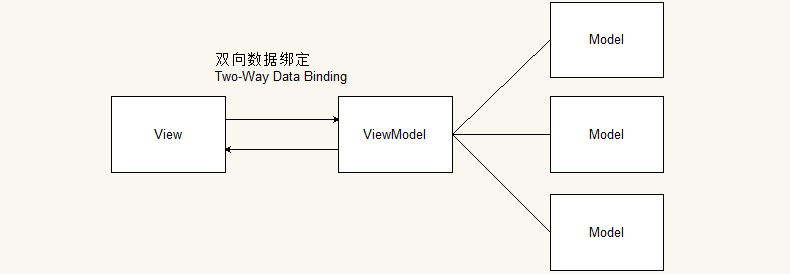


