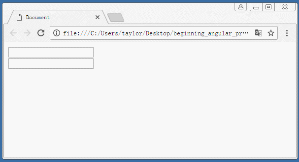

# ng 基本模型

作为初学者使用 ng 的步骤可以归纳为:

- 引入 ng 包
```html
<script src="xxxx/angular.js"></script>
```
- 在页面中需要用 ng 处理的标签上写上 `ng-app="模块名"`. 此处的模块名与标识符的命名约定一样. 一般用于学习可以将 `ng-app` 写在 `body` 标签上.
- 在需要使用 ng 处理的代码上使用 `ng-model` 来关联前后的变量名, 该名字即会成为背后对象的属性, 即可实现前后数据的同步.
- 然后创建 `script` 标签, 并使用代码 `angular.module( '模块名', [] )`, 来创建模块. 其中模块名即为 `ng-app` 后面的名字, 而方法中紧跟的 `[]` 表示依赖模块. 后面会详细讨论到模块的依赖, 这里先空着. 
- `angular.module` 方法返回一个模块对象, 我们可以使用变量接收, 然后使用变量进行后续操作. 也可以使用链是编程, 来提供后面的代码处理.
```javascript
// 例如:
var app = angular.module( 'app', [] );
app.run( function ( $rootScope ) {
    $rootScope.text = '初始化文本';
});
// 亦或使用链是编程格式
angular.module( 'app', [] )
       .run(function ( $rootScope ) {
            $rootScope.text = '初始化文本';
        }); 
```

注意: 
- 上述方法也就是只是在演示 ng 的一般使用方法. 这个步骤是最简单的, 但是要灵活使用 ng 的各种功能, 我们还需要学习很多后续内容.
- 对于很多案例, ng 几乎可以不写任何代码. 但是这仅仅是在演示 ng 的强大, 没有实际意义. 实际开发是不会使用哪种什么 js 也不写的结构, 这个演示只是一个噱头而已.
- 页面上默认只允许有一个 `ng-app` 的属性, 所以不要创建多个. 按照 ng 的思想, 将一个页面看成一个 app, 一个大的对象.
- 在标签中写的, 诸如 `ng-xxx` 的属性被称为指令( directive ), 是 ng 强大的核心. ng 中大多数功能都是利用给标签添加指令来实现的. 所谓指令, 其实就是在说明某个标签需要执行某些额外的处理.
- 在 `run` 方法中回调函数的写法, 参数 `$rootScope` 也必须原样编写代码. 后面会解释为什么.

## 简单案例

在页面中显示一个文本框, 和一个按钮. 文本框默认显示 0, 点击按钮后文本框中的数字自动加一.

该案例的传统处理方法请读者自行实现, 以体会 ng 带来的好处, 具体代码可以参考 demo 文件夹.

下面用 ng 来实现, 首先我们考虑一下这个业务如何抽象出对象模型.

首先需要实现累加计算, 那么页面中的文本框, 就是需要与背后对象数据同步的结构. 因此在文本框中可以使用 `ng-model` 来提供数据的名字. 即背后的对象也会使用该名字. 例如:

```html
<body>
    <input type="text" ng-model="txt" /><button>click</button>
</body>
```

然后在点击按钮的时候会使得该数据变化, 也就是说要在按钮上绑定事件. 这里使用 ng 的事件指令 `ng-click`. 

它的用法与 `onclick` 类似. 在传统 `onclick` 的用法中有这样一种用法:

```html
<button onclick="alert( '点击了按钮' )">click</button>
```

在点击该按钮后, 会执行 click 事件, 即将 `onclick` 中的字符串作为代码来执行. 在逻辑上就好像写在 `onclick` 
中的字符串, 就是一个匿名函数一样. 在点击按钮的时候就会触发该事件, 即会调用该事件处理函数. 

同样在 ng 中, `ng-click` 的用法也是如此. 但是略有不同. 如果写成: 

```html
<button ng-click="myclick()">click</button>
```

代码在运行的时候, 字符串 `"myclick()"` 也会当做 "匿名函数" 来执行. 不同的是该匿名函数的上下文是我们前文中提到的 
"背后的对象". 

我们知道在 MVVM 中将 dom 操作转换成了对对象的操作, 也就是说在页面的背后会有一个对象. 我们在页面中使用的所有 
`ng-model` 提供的名字都是这个对象的属性. 同样我们使用 `ng-click` 里面的方法都是这个对象的方法. 

即这里使用 `<button ng-click="myclick()">click</button>` 表示背后的对象上有一个方法, 方法名为 `myclick`,
在点击该按钮后, 就会调用该对象的这个方法. 

综上我们可以得到一个对象结构:

```javascript
var $rootScope = {
    txt: 0,
    myclick: function () {
        // ...
    }
};
```

这个对象结构与前面的界面互相关联. 按照前面 MVVM 的逻辑, 凡是在页面中修改了文本框的内容, 
ng 就会把数据同步到该对象的 `txt` 属性上. 在界面上点击按钮, ng 就会触发调用 `myclick` 方法. 

反过来, 我们如果在 ng 代码中修改了 `txt` 属性, 即会将该属性值同步到 界面上. 
这里需要注意的是在 ng 的代码内部修改, 那么代码内部在哪呢? 看下面代码:

```javascript
angular.module( 'app', [] )
       .run( function ( $rootScope ) {
           // 哪里是 ng 内部???
       });
```

很显然, 所谓的 ng 代码内部就是在 run 方法参数中的这个回调函数里. 因此我们只需要在点击触发的 `myclick` 
方法里处理 `txt` 属性即可. 

综上所述, 代码可以写成:

```html
<body ng-app="app">
    <input type="text" ng-model="txt"><button ng-click="myclick()">click</button>
    <script>
        angular.module( 'app', [] )
               .run( function ( $rootScope ) {
                    $rootScope.txt = 0;
                    $rootScope.myclick = function () {
                        this.txt = this.txt - 0 + 1;
                    };
               });
    </script>
</body>
```

注意: 
- 在页面运行的时候, `run` 方法仅会调用一次, 所以可以将初始化的代码写在这里.
- 在该代码结构中可以看到方法 `myclick` 直接绑定到了 `$rootScope` 上, 也就是说其上下文( 就是 `this` )是 `$rootScope`. 
- 由于文本框中存储的是字符串, 所以要先减去 `0`, 以转换成数字后再加 `1`.


### 根据上述分析, 大家可以做一个练习

要求在页面中放置两个文本框, 对其中一个文本框输入数据, 另一个文本框同步该输入( 请先思考在实现, 不要看答案 ). 
演示效果如下:




## 一些简单结论

- 在 ng 中, 凡是在页面中使用了 `ng-app` 即在代码背后存在一个对象. 该对象就是 `$rootScope`.
- 在 ng 中, 凡是需要对页面中的数据进行操作, 都应该使用 `ng-model`, 将该操作转接到背后的对象上.
- 在 ng 中, 凡是使用了指令, 在指令中使用的内容似乎都应该是背后的对象 `$rootScope` 的属性或方法.


## 是否需要给 `ng-app` 提供数据


