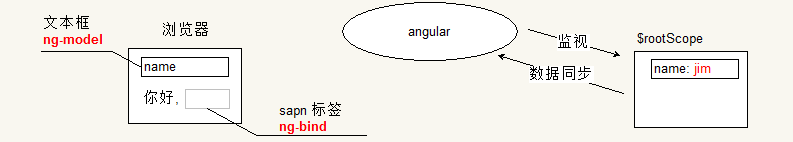
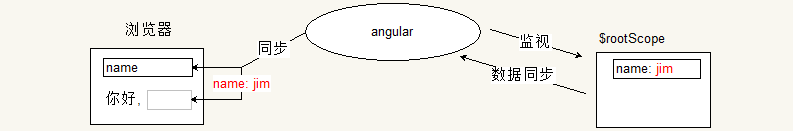

# 数据绑定与表达式

从前文的介绍中可以看到, 界面的 html 中可以使用 `ng-xxx` 的属性命名一些名字. 
然后背后的对象上维护对应的属性, 即可实现前后的同步.

这样将界面中的 "名字" 与背后的对象的绑定被称之为数据的绑定. 

在界面中使用 `ng-model`, 可以实现双向数据绑定. 即*界面修改同步背后属性修改, 背后属性修改同步界面修改*.


## `ng-bind` 单向数据绑定( data-bind )

在标签中还可以使用 `ng-bind` 来实现单向的绑定. 在界面中呈现数据, 往往是以展示数据为主( 这个看项目需求, 并非绝对 ).
例如展示数据列表, 某个页面的菜单, 某个网站的站点导航等. 这些数据不需要用户修改. 一般只有在表单处理, 
或需要记录数据的时候才需要用户输入. 

所以并非每一个标签中都要使用 `ng-model`, 如果只需要单向绑定. 即背后对象属性修改, 就触发前面界面的数据修改. 
那么可以使用 `ng-bind` 指令. 

它的使用与 `ng-model` 一模一样, 唯一不同的是, 不需要写到输入框中. 例如案例: 

```html
<body ng-app="app">
    <input type="text" ng-model="name"><br>
    你好, <span ng-bind="name"></span>
    <script>
        angular.module( 'app', [] )
                .run( function ( $rootScope ) {
                    $rootScope.name = 'jim';
                });
    </script>
</body>
```

分析:
- 在 `run` 方法中初始化对象 `$rootScope` 的 `name` 属性为 `'jim'`. 



- 对属性的设置触发 ng 将数据同步到界面中.
- 页面中使用 `ng-bind` 的标签内部会使用对应的数据进行填充( 注意, 默认不允许 html 字符串 ). 使用 `ng-model` 的输入框亦会如此.



- 在前台界面的文本框中输入数据的时候, 会触发 ng 将界面的数据变化记录下来, 并通知背后的对象.
- 将数据同步到背后的 `$rootScope` 对象的 `name` 属性上.


- 由于此同步使得 `$rootScope.name` 发生变化, 又会触发一次 ng 监视同步行为. 
- 将该数据同步到界面的 `ng-bind` 所在的标签中.
- 从后向前的同步会同时发生在 `ng-bind` 和 `ng-model` 上, 但是由于此次同步的数据, 与 `ng-model` 中的数据相同, 所以不会进行数据的修改, 也就不会再发生同步逻辑. 事实上, 如果依旧有数据变化, 还是会触发一次同步逻辑. 在 ng 中这个循环会在执行到 第 10 次的时候强制终结, 并抛出一个异常. 
- 由于 `ng-bind` 是单向数据绑定, 因此在界面中它的数据变化不会触发 angular 监视行为.


在 ng 中数据绑定的案例特别多. 除了使用 `ng-bind` 外, 在页面中还可以使用插值语法.

## 插值( interpolation )

在 ng 中提供一种插值语法. 默认使用双花括号括起来. 例如: 

```html
<p>你好, {{ name }}</p>
```

使用 `ng-bind` 固然很好, 但是在一些 DOM 属性中, 或是一些字符串中就无法使用了. 因为它必须写在标签上. 但是插值语法就要容易得多. 
例如刚才那个案例:

```html
<body ng-app ng-init="name='jim'">
    <input type="text" ng-model="name"/>
    <br />
    你好, {{ name }}
</body>
```

该代码的执行分析与上一个案例一致. 这里仅仅是在比较插值语法与 `ng-bind` 的方便之处.


## 表达式( expression )

在编程语言中, 表达式是由数据与运算符连接起来具有计算结果的语法结构, 或运算结构. 但是在 ng 中这一概念被推广.

在 [ng 官网文档](https://code.angularjs.org/1.5.11/docs/guide/expression)中这么定义:

<!-- 
Angular expressions are JavaScript-like code snippets that are mainly placed in interpolation bindings such as <span title="{{ attrBinding }}">{{ textBinding }}</span>, but also used directly in directive attributes such as ng-click="functionExpression()".
 -->

    Angular 表达式是一个类似于 JavaScript 的代码片段. 该代码片段主要用于数据绑定中插值的替换. 
    例如: <span title="{{ attrBinding }}">{{ textBinding }}</span>, 同时也用于指令属性中.
    例如: ng-click="functionExpression()"

换句话说, 我们之前使用的 `ng-bind`, `ng-click`, `ng-model` 等指令中的内容都是 angular 的表达式.

那么在 ng 中的表达式与 以前讨论的 javascript 的表达式有什么区别呢?

### 首先上下文不同

在 javascript 中, 一般表达式的上下文为全局的 `window`( 闭包中的除外 ). 例如调用一个函数, 
实际上是调用全局对象 `window` 的方法. 

而 ng 中, 上下文为当前标签背后的对象, 即前面讨论的 `$rootScope`. 所以常常出现的错误中有一个就是弄错了上下文. 

例如要实现两个文本框的自动求和的逻辑. 下面的代码就无法运行成功:

```html
<body ng-app>
    <input type="text" ng-model="num1">
    +
    <input type="text" ng-model="num2">
    =
    <span ng-bind=" parseInt( num1 ) + parseInt( num2 ) "></span>
</body>
```

这里运行没有结果, 原因是表达式中使用了 `parseInt`, 也就是说 ng 会假定该方法是 `$rootScope` 的.
但是很显然没有该方法, 古不会有任何结果. 这一点也是 ng 表达式的特点, 在表达式中, 处理了不存在的数据,
或调用了不存在的方法, 是不会报错的. 

如果将最后一句代码修改为下面的样子, 就可以得到结果了:

```html
<span ng-bind=" ( num1 - 0 ) + ( num2 - 0 ) "></span>
```

### 容错性

好比上一个特点中提到的, 在 ng 中, 如果一个数据为 `null`( 或 `undefined` ), 而求其属性的值, 
则会得到一个异常. 

但是在 ng 中, 无论是对象为 `null` 还是 `undefined`, 该计算都不会出现错误.

### ng 可以使用过滤器

在 ng 中含有一种特殊的语法, 允许在表达式中使用 过滤器( filter ). 所谓的过滤器, 是一种处理数据,
或格式化数据的函数. 它可以将数据处理成我们想要的形式. 例如下面代码: 

```html
<body ng-app ng-init="money=123">
    <p>{{ money }}</p>
    <p>{{ money | currency }}</p>
    <p>{{ money | currency: '¥' }}</p>
</body>
```

其运行结果为:


竖线是过滤器语法, 过滤器 `currency` 实际上是一个函数. 该函数提供两个参数, 
一个参数是竖线前面的值( 一般就是前面绑定的属性 ), 另一个参数是过滤器后面冒号后的参数.
该过滤器的目的是将数据以货币的形式进行输出, 即数字后需要带有两个小数位. 
同时在数字前面带有货币的类别字符. 如果 `currency` 后面没有参数, 即默认参数为美元符.

ng 支持很多过滤器, 还支持自定义过滤器. 至于过滤器的细节我们后面再讨论.


### 不允许流程控制

### 不允许函数定义

### 不允许包含正则字面量

### 不允许使用 new 关键字

### 不允许使用位运算, 逗号运算和 void 运算符


在 ng 表达式中有很多不允许, 大多数不允许是因为 ng 背后会利用词法分析的方式解析表达式.
而流程控制, 斜线, new 等内容都会影响到解析的算法. 至于不允许使用位运算符, 
是因为 竖线已经是过滤器的语法结构了.

一般正常使用表达式不会有什么问题. 核心需要注意的是 ng 中表达式中的每一个标识符, 都会对应背后对象的属性.


