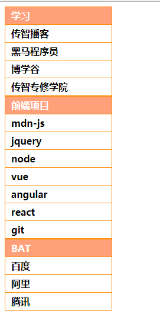
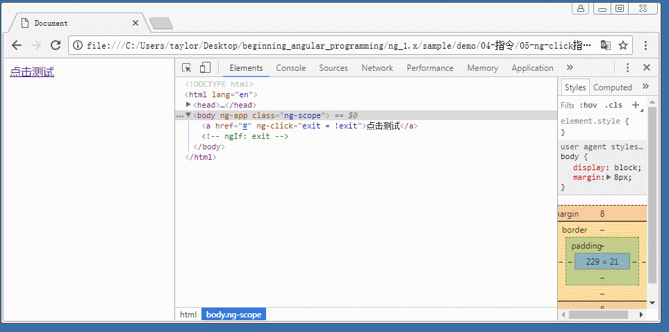

# 常用内置指令

所谓的指令( directive ), 就是额外需要执行代码的标记. 
ng 中我们已经接触过的指令有: `ng-app`, `ng-init`, `ng-model`, `ng-bind`, `ng-show`, `ng-click` 等.

指令就是额外需要执行的标记, 例如 `ng-app` 一写, 就会使 ng 将该标签以及其所有子标签作为维护的标签, 
同时背后就会创建一个维护的对象. 

再如, `ng-init` 表示初始化, 凡是在该指令中写的赋值逻辑, 都会在背后的对象中初始化对应的属性.

又如 `ng-model`, 凡是出现在其中的标识符, 都会在背后提供对应属性. 同时 ng 会自动帮助我们添加事件与监听的方法. 
只要一侧数据发生变化就会触发同步.

...

综上所述, 凡是写到指令的地方, 就是在该范围内需要额外的执行逻辑. 

在 ng 中还有很多的指令. ng 中指令有四种形式:

- 以属性的形式存在. 前面接触的指令均是如此.
- 以标签的形式存在. 例如 `ng-view` 等, 后面会陆续说明.
- 以 class 的形式存在. 这个相对使用较少.
- 以注释的形式存在. 这个我们自己使用的较少.

接下来我们一一举例说明常用的指令( **该部分只会介绍该阶段可以使用的指令, 部分指令还需要后续内容支撑** ).

可以参考[文档](https://docs.angularjs.org)中的 directive 部分 


## 控制指令

这里我们介绍 `ngIf` 和 `ngRepeat` 指令的用法.

> 注意: 在 ng 中, 所有的指令描述都采用 骆驼命名规则. 但是在 html 中使用的时候, 均采用 连字符 连接的小写字符形式.


### ngIf 指令

该指令语法:

```html
<tag ng-if="表达式">...</tag>
```

其含义为, 如果 `ng-if` 中绑定的数据, 表达式的值如果为 `true`, 则表示该标签会呈现在 DOM 结构中.
若该表达式的值为 `false`, 则该标签就不会出现在 DOM 树中. 注意不是隐藏, 是根本就不会出现在 DOM 结构中.

看下面代码:

```html
<body ng-app>
    <div ng-if="exist">
        测试数据
    </div>
</body>
```

运行查看代码的 DOM 结构:


简单分析:
- 页面加载运行, 由于 `ng-app` 后面没有提供任何名字. 因此 我们不用编写任何代码, ng 会自动维护一个背后的对象.
- 由于标签中没有提供 `ng-init` 指令, 所以在背后对象中, 没任何成员.
- 而标签中的 `ng-if` 指令中使用了 表达式 `exist`, 而背后的对象中又没有该属性, 即表达式的值为 `undefined`
- 因此 `ng-if` 表达式的值为 `false`, DOM 结构中不会提供该节点.

如果在代码中加上下面代码结果会怎样呢? 请自行分析运行的原理.

```html
...
<body ng-app ng-init="exist=1">
...
```


### ngRepeat 指令

`ng-repeat` 指令允许在页面中利用数据构造结构重复的标签. 例如菜单结构, 表格结构, 选项卡结构等.
其语法为:

```html
<tag ng-repeat="迭代变量 in 集合">...</tag>
```

需要哪一个标签重复生成, 这个指令就放到哪一个标签上. 例如需要生成一个 `ul-li` 的列表, 需要利用数组重复生成 `li` 标签,
那么就需要将 该指令 放在 `li` 标签上( 注意不是放在 `ul` 标签上 ).

在 `ng-repeat` 的表达式中, '集合' 就是背后对象的成员. 而迭代变量有用户自己定义(需要满足标识符规则), 
类似于 js 中 for-in 循环语法. 该变量会在循环生成 `li` 标签的时候使用.

例如我们需要利用一个数组生成一个 `ul-li` 标签.

```html
<body ng-app="app">
    <ul>
        <li ng-repeat="item in list">{{ item }}</li>
    </ul>
    <script>
        angular.module( 'app', [] )
            .run(function ( $rootScope ) {
                $rootScope.list = [ 1, 2, 3 ];
            });
    </script>
</body>
```

其运行结果为:


简单分析:

- 首先我们手动创建了一个模块, 并在背后的 `$rootScope` 对象上提供了 一个 属性 `list`, 里面存储数据 1, 2, 3.
- 然后页面中使用 `ng-repeat` 指令. 该指令遍历 `list`. 
- 根据前文的说明, 凡是需要使用的名字都是背后对象的属性, 因此就是在遍历 数组 `[ 1, 2, 3 ]`.
- 每一次遍历都会创建一个临时变量 `item`, 我们称其为迭代变量. 由于数组中有三个数据, 因此会进行三次遍历, 每次 `item` 变量中存储的数据分别为 `1`, `2`, 和 `3`.
- 进行三次遍历就会创建 3 个 `<li>` 标签. 标签中利用插值将 item 的数据存储到 `li` 内.


我们再来看一个较为复杂的案例:

我们有一个数据结构:

```javascript
var data = [
    { title: '学习', submenus: [
        { title: '传智播客', link: 'http://www.itcast.cn/' },
        { title: '黑马程序员', link: 'http://www.itheima.com/' },
        { title: '博学谷', link: 'https://www.boxuegu.com/' },
        { title: '传智专修学院', link: 'http://www.czxy.com/' }
    ] },
    { title: '前端项目', submenus: [
        { title: 'mdn-js', link: 'https://developer.mozilla.org/zh-CN/docs/Web/JavaScript' },
        { title: 'jquery', link: 'http://jquery.com/' },
        { title: 'node', link: 'https://nodejs.org/en/' },
        { title: 'vue', link: 'https://cn.vuejs.org/' },
        { title: 'angular', link: 'http://angular.org/' },
        { title: 'react', link: 'https://reactjs.org/' },
        { title: 'git', link: 'https://github.com/' }
    ] },
    { title: 'BAT', submenus: [
        { title: '百度', link: 'https://www.baidu.com/' },
        { title: '阿里', link: 'https://www.aliyun.com' },
        { title: '腾讯', link: 'http://www.qq.com/' } 
    ] }
];
```

要求利用 ng 来生成一个菜单. 效果如图:



其 HTML 结构为: 


其代码的实现为:

```html
<body ng-app="app">
    <div class="menu">
        <ul>
            <li ng-repeat="item in list">
                <a href="#">{{ item.title }}</a>
                <ul class="submenu">
                    <li ng-repeat="subitem in item.submenus">
                        <a href="{{ submenu.link }}" target="_blank">{{ subitem.title }}</a>
                    </li>
                </ul>
            </li>
        </ul>
    </div>
    <script>
        angular.module( 'app', [] )
            .run(function ( $rootScope ) {
                $rootScope.list = data;
            });
    </script>
</body>
```

其运行的原理与过程请自行分析.


## 事件相关指令

前文已经介绍过的事件相关的指令有 `ng-click`, 我们简要复习一下其用法.
- 首先该指令的用法与时间类似, 写在 该指令中的字符串会作为代码进行执行
- 在该指令中一般写上方法的调用语法, 或直接进行数据赋值等操作.
- 而该指令中的名字( 标识符 )或方法调用, 其名字都是 背后对象的成员.

配合 `ng-if` 可以控制点击行为, 来使得某些标签移除与添加. 例如:

```html
<body ng-app>
    <a href="#" ng-click="exit != exit">点击测试</a>
    <ul ng-if="exit">
        <li><a href="#">数据数据</a></li>
        <li><a href="#">数据数据</a></li>
        <li><a href="#">数据数据</a></li>
    </ul>
</body>
```

其运行效果为:



ng 中提供了很多类似的事件指令, 结合多个指令混合到一起使用会变得非常强大.

常见的事件指令有:

```javascript
    ngChange
    ngClick
    ngDblclick
    ngMousedown
    ngMouseup
    ngMouseover
    ngMouseenter
    ngMouseleave
    ngMousemove
    ngKeydown
    ngKeyup
    ngKeypress
    ngSubmit
    ngFocus
    ngBlur
    ngCopy
    ngCut
    ngPaste
```

其用法与 `ng-click` 一样, 意义如字面一样. 

下面我们看一个案例, 效果如下: 


提供的数据如下:

```javascript
var data = [ {   
    name: '纪明杰', 
    gender: 'm', 
    birthdate: '1973-3-31', 
    join: '2005-1-15', 
    address: '四川省  阿坝藏族羌族自治州', 
    email: 'Corey19730331@yahoo.cn', 
    phone: '13198561347' 
}, { 
    name: '邓健柏', 
    gender: 'm', 
    birthdate: '1975-11-30',
    join: '2008-1-15',
    address: '广东省  潮州市', 
    email: 'Andrew19751130@yeah.net', 
    phone: '13888543794' 
}, { 
    name: '濮阳语儿',
    gender: 'f',
    birthdate: '1984-1-31',
    join: '2012-5-15',
    address: '安徽省  巢湖市', 
    email: 'Charlotte19840131@yahoo.cn', 
    phone: '13918704172' 
}, { 
    name: '嵇志强', 
    gender: 'm', 
    birthdate: '1979-7-31', 
    join: '2007-12-15',
    address: '河南省  漯河市', 
    email: 'Levi19790731@21cn.com',
    phone: '15918104461' },
{ 
    name: '居博超', 
    gender: 'm', 
    birthdate: '1986-12-31',
    join: '2008-5-15',
    address: '江苏省  南通市', 
    email: 'Enoch19861231@yahoo.com.cn', 
    phone: '13825143219' 
}, { 
    name: '窦弘文', 
    gender: 'm', 
    birthdate: '1974-2-28', 
    join: '2007-5-15', 
    address: '贵州省  安顺市', 
    email: 'Bartholomew19740228@yeah.net', 
    phone: '15953281032' 
}, { 
    name: '邰浩然', 
    gender: 'm', 
    birthdate: '1989-4-30', 
    join: '2009-2-15', 
    address: '广东省  茂名市', 
    email: 'King19890430@yahoo.com.cn', 
    phone: '13824309057' 
}, { 
    name: '弓天磊', 
    gender: 'm', 
    birthdate: '1986-12-31',
    join: '2005-11-15', 
    address: '安徽省  黄山市', 
    email: 'Bowen19861231@yahoo.cn', 
    phone: '15844437988' 
} ]; 
```


简要分析实现过程:
