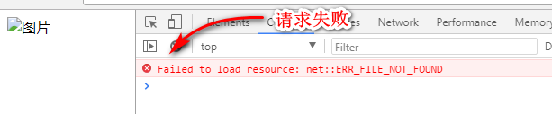

# 常用内置指令( 续 )

接下来继续讨论内置指令: 

<!-- ## 属性与样式指令

所谓的属性指令, 是说原本标签就有的属性, 但是在 ng 环境中原有属性的使用会出现问题, 所以 ng 对部分属性进行了封装,
得到了一些属性指令. 它们包括: `ng-href`, `ng-src`. 
事实上, 样式也是属性中的一种, 只是使用的过于频繁, 所以我们将其单独分类, 它包括: `ngClass`, `ngCloak`, `ngShow`, `ngHide`, 和 `ngStyle`. -->

## `ng-href` 与 `ng-src` 指令

这些指令的只用与标签属性的使用一样, 但是功能会更加 "智能" 点. 
例如在 ng 中如果需要设置一张图片的地址, 可以将代码写成: 

```html

```

但是 ng 的执行是需要时间的, 浏览器先要下载 html, css, js 等文件, 然后下载这些文件后, 需要解析 html, 
渲染 css, 同时要执行 js 代码. ng 的代码如果需要从网络中下载执行就会需要花费一些时间( 因为 ng 的库相对较大, 
而且需要配合网速, 网速一般是不确定的 ). 所以如果在 ng 执行结束之前, 在页面中图片就不会显示出来, 甚至显示一个错误的图片效果. 例如:



所以为了提高用户的体验, 应该更换成 `ng-src` 指令, 写成: 

```html

```

那么在 ng 程序执行结束之前, `img` 标签是没有 `src` 属性的, 也就不会发送图片请求. 在 ng 程序运行结束后,
背后的对象就会含有 `imgUrl` 属性, 同时含有数据. 同时 ng 就会将 `img` 标签的 `ng-src` 属性替换成 `src`
属性, 浏览器再发送图片请求, 从而显示图片.

`ng-href` 指令的用法与 `ng-src` 指令的用法是一样的.


## 样式相关指令

实际上设置标签的样式可以直接使用:

```html
<tag class="{{ className }}">...</tag>
<tag style="{{ styleValue }}">...</tag>
```

不过 ng 提供了更加好用的对应指令. 它们分别是: `ngClass`, `ngStyle`, `ngCloak`, `ngShow`, `ngHide`.

### `ng-class` 指令

该指令的语法为:

```html
<tag ng-class="表达式">...</tag>
```

说明:
- `ng-class` 指令有三种用法: 字符串, 对象, 或数组.
- 如果表达式的结果是一个字符串, 那么字符串可以使用一个用空格分隔开的各个类样式的名字.
- 如果表达式的结果是一个对象, 那么该对象的每一个键值对用于表示该标签可以使用的类样式. 键值为 `true` 的键名会作为类样式的名字用于该标签.
- 如果表达式的结果是一个数组, 那么数组的元素必然是第一种或第二种情况.

使用案例: (略)

### `ng-Style` 指令

该指令的语法为:

```html
<tag ng-style="表达式">...</tag>
```

说明:
- 表达式的结果应该是一个对象, 对象的键值对构成 css 的样式属性与对应的值

使用案例: (略)

<!-- ## 表单指令 -->


<!-- ## 其他指令 -->

