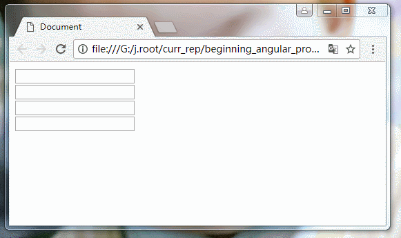
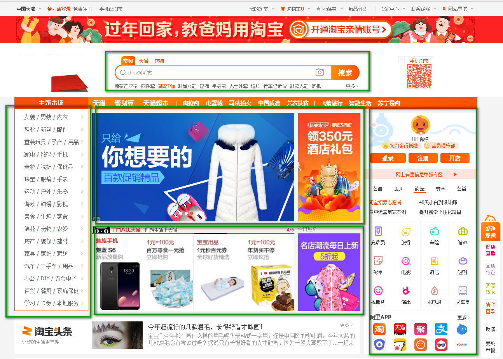
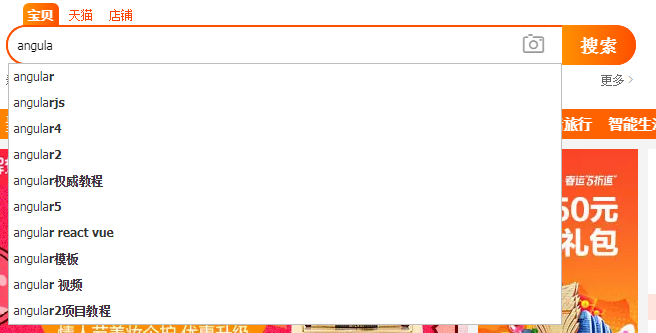
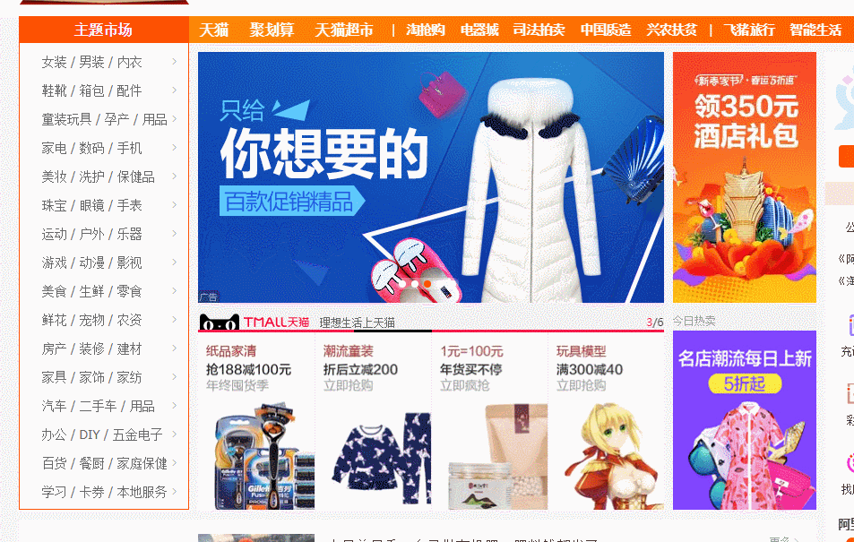
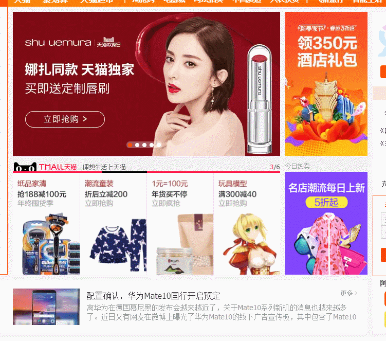
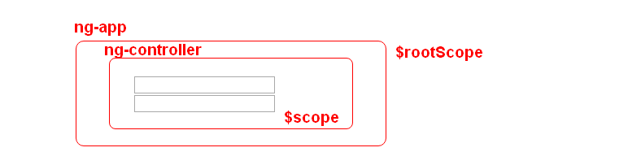
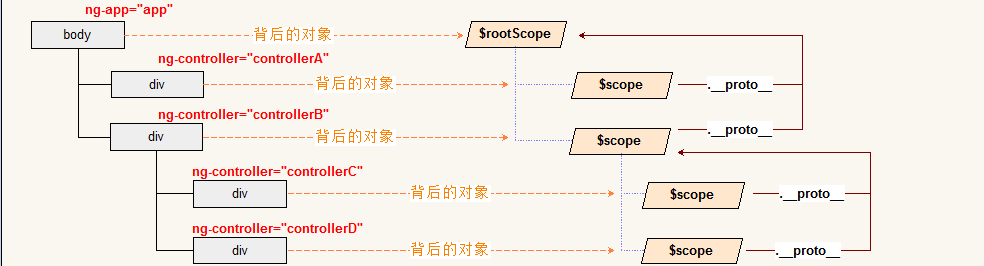

# 控制器( controller )与作用域( scope )

我们首先来看一个案例:



在该案例中有两组输入框, 每一组输入框由两个文本框组成. 每一组都有一个功能, 就是输入其中一个文本框,
另一个文本框会同步数据; 若对另一个文本框做同样的事情, 对应的文本框也会提供数据的同步. 
思考一下这个怎么实现呢?

核心并不是如何实现, 因为按照前问的介绍, 只需要在 `$rootScope` 上维护两个属性, 然后每组文本框维护一个属性即可.
但是这并不是重点. 重点是对于复杂的页面逻辑, 例如类似于京东, 淘宝这样的网站界面, 每一个页面中包含很多独立的逻辑部分.
看下面的图:



在页面中含有多个部分: 搜索框部分, 菜单栏部分, 轮播图部分, 便捷操作部分 等. 每一个部分都有独立的功能:

- 搜索框输入数据会理解给出推荐词汇, 或搜索词频较高的推荐词. 例如:



- 菜单栏在鼠标移入的时候会自动打开对应的二级菜单.



- 轮播图会在规定时间内自动的进行切换, 同时在鼠标进入后计时器会停止, 在鼠标移开后, 计时器又会工作.



- 而便捷操作会提供用户的的一些便民操作, 例如充话费, 新闻, 旅行, 关注等内容.

*可见在很多实际的案例中, 一个页面包含多个部分, 而每一个部分都是独立的, 它维护自己的一套逻辑与功能. 同时各个部分之间功能上一般没有关系, 但是可以共享数据.*

再回到前面的案例中, 我们可以发现, 两组文本框可以看成两个独立的业务逻辑. 要维护业务逻辑, 可以在 `$rootScope` 中定义多个变量来统一维护.
但是这样也会造成混乱: 多个业务逻辑的数据混合在一起, 都挂载到 `$rootScope` 上, 完全不加以区分. 
因此, 我们需要将其分开, 让各个功能互相独立起来. 同时每一个功能部分维护一个类似于 `$rootScope` 的对象, 每一个部分同样支持双向数据绑定.
然而每一个部分都是独立的逻辑结构, 独立的业务.

为了实现这个要求, 我们引入控制器( controller ).


## 控制器( controller )

在 ng 中将整个页面看成一个对象( 使用 `ng-app` 标记 ), 同时在 app 的内部可以包含多个控制器( controller ). 
控制器的作用是将整个用 `ng-app` 维护的页面分解成多个部分, 每一个部分在逻辑上也是一个独立的 app( 类比 ). 
可以将整个 `ng-app` 维护的部分看成一个公司, 而每一个控制器部分是公司内的各个独立的部门.

每一个部门也有员工, 管理者, 是一个独立运营的结构. 但是一个公司的所有部门又组成整个公司. 
类似的, 每一个控制器是独立的运行部分. 按照前文的介绍, 就是含有独立双向数据绑定的结构.
而所有的控制器又包含在 `ng-app` 中, 属于其下的结构. 这样就可以在一个 `ng-app` 中维护多个独立的部分了.
这样也就可以轻松构建结构更加复杂的页面了.

### 创建控制器

控制器是一个独立的结构, 所以也是由界面上的 html 和背后的对象所构成. 创建控制器可以使用下列步骤:

- 在页面中的对应标签处使用指令: `ng-controller="controllerName"`, 提供控制器的名字.
- 然后在背后的代码中, 使用模块的 `controller` 方法来创建对应的控制器. 代码如下
```javascript
    module.controller( 'controllerName', function ( $scope ) {
        // ...
    });
```
- 在这段代码中, 需要提供这个控制器对应的 HTML 上使用的名字, 然后提供一个函数, 这个函数类似于前面 `run` 方法中的函数.
- 这样回调函数中的 `$scope` 类似于前面的 `$rootScope`, 就是在当前控制器描述的标签结构的背后的对象.
- 注意此时的回调函数中的参数不能做任何更改, 必须原样书写.

### 使用案例

创建一个控制器, 来维护双向数据绑定.

- 引入 ng 的 js 库, 然后在页面中添加 `ng-app` 和 `ng-controller` 指令, 并同时提供名字.

```html
<body ng-app="app">
    <div ng-controller="controller">
    </div>
</body>
```

- 在标签中提供两个文本框, 同时提供 `ng-model` 指令, 实现数据绑定

```html
<body ng-app="app">
    <div ng-controller="controller">
        <input type="text" ng-model="txt"><br />
        <input type="text" ng-model="txt">
    </div>
</body>
```

- 提供 `<script>` 标签, 然后添加创建模块与创建控制器的代码:

```javascript
    angular.module( 'app', [] )
        .controller( 'controller', function ( $scope ) {
        });
```

- 这里不需要使用 `$rootScope`, 因此也就不需要提供 `run` 方法. ( 当然你要是添加也无妨 )


大家可以运行一下这段代码, 看看有什么效果. 类似的我们也可以在页面中创建多个控制器, 独立的维护多个页面模块.


## scope

在引入控制器后, 我们的页面结构就变成如下结构:



事实上, 页面中的所有 scope 也有一个隐含的关系: 

- 所有的 `$scope` 都是直接或间接原型继承自 `$rootScope` 的.
- 在页面中如果有嵌套的 控制器, 内部控制器的 `$scope` 原型继承自外层控制器的 `$scope`.
- 所有同级的 控制器, 其背后维护的 `$scope` 是互相独立的对象.

即如果有下面代码:

```html
<body ng-app="app">
    <div ng-controller="controllerA">
        ...
    </div>
    <div ng-controller="controllerB">
        <div ng-controller="controllerC">
            ...
        </div>
        <div ng-controller="controllerD">
            ...
        </div>
    </div>
</body>
```

DOM 树结构与背后对象的继承结构关系为:



那么按照这个继承结构, 根据属性搜索原则, 成员的访问就可以通过原型链来访问.


