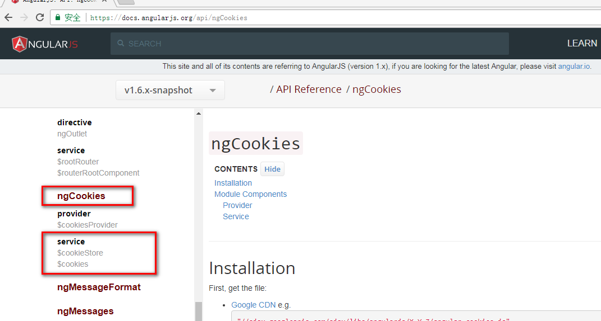
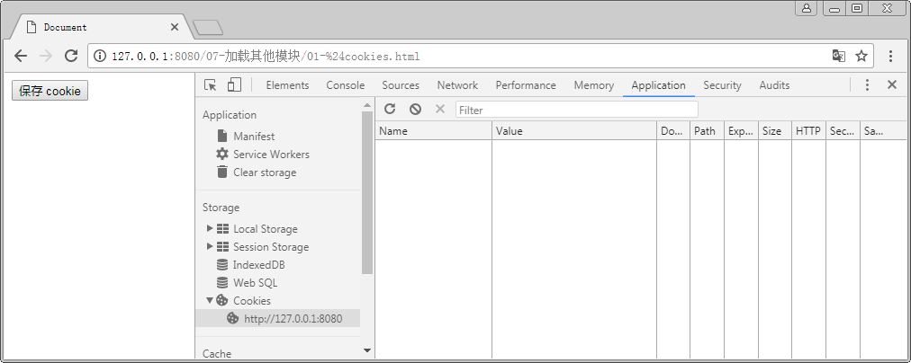
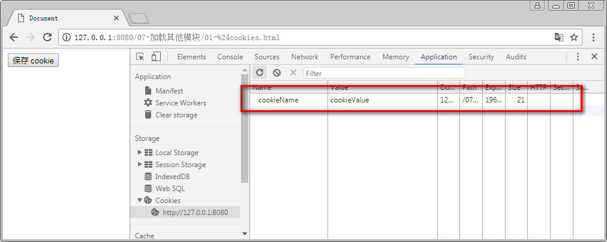

# 模块依赖

在前文中, 创建一个模块使用的语法为 `angular.module( 'ng-app 的名字', [] )`. 这个语法在创建一个命名的模块. 
那么这个方法中的参数 `[]` 有什么意义呢? 接下来我们老套路这个具体的用法.

## 创建与获得模块


### 传统方式解决全局污染问题

在传统 js 开发中, 有一个非常容易遗留的危险, 就是全局作用域污染. 为了解决这个文件, 我们使用了闭包, 将所有的代码都包裹在闭包中.
但是依旧需要将一些数据通过返回值, 或其他办, 将一些需要被公开的数据映射到全局对象 `window` 上. 

```javascript
// jquery 模型( 1.7 以前)
(function ( window, undefined ) {
    // ...
    window.jQuery = window.$ = jQuery; // 将 jQuery 与 $ 映射到 全局对象中.
})( window );
```

但是这个方式依旧不能根本解决问题. 因为依旧会在全局作用域中保留部分数据. 这个也是没有办法的, 因为数据需要共享.

### ng 中处理办法

但是在 ng 中会更简单. 使用 `angular.module( '模块名', [] )` 来创建模块. 
这里值得注意的是:

- 模块不是必须与页面的 `ng-app` 相关联, 虽然必须有一个要关联起来. 但是在整个项目中 可以存在多个模块.
- 模块的创建不需要使用变量来引用. 在左边放置一个变量接收模块, 是为了在后面更简单的使用模块. 事实上 ng 还有一个语法专门用于获得模块.

使用下面语法:

```javascript
    angular.module( '模块名' )
```

- 这个方法的调用需要注意的是, `module` 的参数只有一个, 即模块的名字, 没有第二个参数( 很奇怪吧 ).
- 这个方法不是在创建模块, 而是在获得模块. 即在 ng 内部找寻指定名字的模块.
- 如果这个名字的模块不存在, 就会报错, 如果存在, 则返回该模块.

这样的一个简单的用法可以从根本上解决作用域污染的问题, 因为可以如下使用:

```javascript
(function () {
    // 创建模块
    angular.module( 'moduleApp', [] );
})();


(function () {
    // 使用模块
    angular.module( 'moduleApp' )
        .run( [ '$rootScope', function ( $rootScope ) {
            // ...
        } ] )
        .controller( 'mainController', [ '$scope', function ( $scope ) {
            // ...
        } ] );
})();
``` 

很显然, 没有在全局范围内引入多余变量. 

不仅如此, ng 还可以多个模块协同使用.


## 加载其他模块

在 ng 中可以创建多个模块, 但是实际开发中会人为约束一些模块的逻辑关系. 
例如在整个程序中可以有多个模块, 但是我们总是会提供一个主模块, 和其他工具模块. 一般工具模块会按照功能分类.
例如: 核心的主模块或用于加载配置核心功能. 而后将不同页面利用不同模块进行定义, 定义多个页面级模块.
还有在一些大规模项目中, 可能需要自己定义一些服务, 指令, 或者过滤器. 那么可以将这些单独的定义成服务模块,
指令模块, 以及过滤器模块等.

上述模块的定义方式不是唯一的, 只是认为给出的一些约束, 定义方法. 事实上模块与模块之间都是平等的.
就好比一个公司的员工都是平等的人, 但是职位从属是有不同的划分.

我们在命名模块的时候为了明确其关系, 常常使用点分命名的方式. 例如核心模块叫 `"mainApp"`, 
该项目中的服务模块可以称为 `"mainApp.services"`.

那么多个模块如何协作呢? 使用下面语法:

```javascript
    angular.module( 'mainApp', [ 'mainApp.services' ] )
```

这里就需要数组参数了, 将需要加载的模块名放到数组中即可, 可以加载多个模块.


## 共享其他模块中的数据

我们通过一些小案例来说明其使用. 
在 ng 的包中有一个 `angular-cookies.js` 文件. 它提供了 ng 对 cookie 操作的功能. 我们可以参考文档:



在该模块中提供了两个服务:

- 一个是 `$cookies`, 用于操作浏览器的 cookie 数据.
- 一个是 `$cookieStore`, 用于操作浏览器的 localStorage. 

这里模块利用一个按钮在 浏览器中存储一个 cookie 数据来看看如何使用这个模块.

- 首先查看文档, 这个模块的名字是: `"ngCookies"`, 索引引入代码写成( 当然需要先引入 js 文件 ):

```javascript
    angular.module( 'mainApp', [ 'ngCookies' ] );
```

- 然后在页面中提供 `ng-click` 指令:

```html
<body ng-app="mainApp"> 
    <button ng-click="saveCookie()">保存 cookie </button>
</body>
```

- 在 `$rootScope` 中注入服务, 并使用 `$cookies` 服务的 `put` 方法写入 cookie 数据:

```javascript
    angular.module( 'mainApp', [ 'ngCookies' ] )
        .run( [ '$rootScope', '$cookies', function ( $rootScope, $cookie ) {
            $rootScope.saveCookie = function () {

                $cookie.put( 'cookieName', 'cookieValue' );

            };
        } ] );
```

- 然后打开浏览器的调试工具查看:

点击按钮之前:



点击按钮之后:




