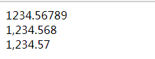
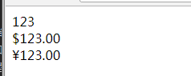
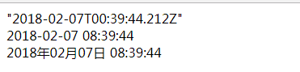

# 过滤器( filter )

在 ng 中, 过滤器就是一个队数据进行处理的函数. 它的特殊之处在于它的用法非常简单. 对于实际开发应用非常的便利.

ng 中内置了很多过滤器, 同时还支持自定义过滤器. 本节中我们首先介绍内置过滤器, 然后介绍如何自定义过滤器.

ng 中的内置过滤器有: 

- `currency`
- `date`
- `filter`
- `json`
- `limitTo`
- `lowercase`
- `number`
- `orderBy`
- `uppercase`


## 内置过滤器的表达式用法

首先, 过滤器的基本用法语法是:

```html
    <tag>{{ propName | filterName: 参数: 参数... }}</tag>
    <!-- 或 -->
    <tag ng-xxxx="propName | filterName: 参数: 参数..."></tag>
```

可以发现, 过滤器的基本用法就是在需要处理的数据后面跟上一个竖线, 然后跟上过滤器的名字即可. 
最后 ng 在渲染显示的时候, 会将数据用过滤器处理后, 将处理的结果显示在对应的位置.

下面分别介绍 ng 提供的内置过滤器:

### `currency` 与 `number` 过滤器

`currency` 是货币过滤器, 用于格式化显示货币使用. 默认会在货币的数字前面加上货币的单位( 默认是美元: $ ), 
通过引入 i18n 中的语言包, 可以修改对应的货币单位, 或者利用参数来修改亦可实现. 同时货币的数字会保留小数点后两位.

```html
<body ng-app ng-init="money=123">
    <div>{{ money }}</div>
    <div>{{ money | currency }}</div>
    <div>{{ money | currency: '¥' }}</div>
</body>
```


运行结果为:




`number` 过滤器主要是为了方便格式化数字输出的格式, 即小数点后的位数. 默认会保留小数点后 3 位. 
使用该过滤器还会对数据进行四舍五入.

```html
<body ng-app ng-init="num = 1234.56789">
    <div>{{ num }}</div>
    <div>{{ num | number }}</div>
    <div>{{ num | number: 2 }}</div>
</body>
```

运行的结果为:



### `date` 过滤器

`date` 过滤器用于会时间类型的数据进行格式化. 一般用法为: 

```html
{{ propDate | date: '格式字符串' }}
```

常用的格式有:

|格式|意义|
|:--|:--|
|`yyyy`|表示四位数年份|
|`MM`|表示两位数字形式月份, 从 01 开始|
|`dd`|表示两位数字形式的日期, 从 01 开始|
|`HH`|表示二十四小时制的两位数小时数|
|`hh`|表示十二小时制的两位数小时数|
|`mm`|表示分钟数|
|`ss`|表示秒数|

例如:

```html
<body ng-app="app">
    <div>{{ current }}</div>
    <div>{{ current | date: 'yyyy-MM-dd HH:mm:ss' }}</div>
    <div>{{ current | date: 'yyyy年MM月dd日 HH:mm:ss' }}</div>
    <script>
        angular.module( 'app', [] )
            .run( [ '$rootScope', function ( $rootScope ) {
                $rootScope.current = new Date();
            }]);
    </script>
</body>
```

运行结果为:




### `filter` 过滤器

`filter` 过滤器是非常强大的过滤器, 主要对数组进行筛选用. 其基本语法为:

```html
{{ array | filter: expression }}
```

- filter 后的参数可以是字符串, 对象, 以及函数
- 如果是字符串, 则会在数组中匹配该字符串, 只要含有该字符串, 就会将该数组项保留下来
- 如果是对象, 则会用该对象对数组中的每一项进行过滤.
- 如果是函数 则会将当前项, 索引与数组的引用传入, 判断函数的返回值如果为 `true`, 则会将该项保留下来


案例: (略)
- 表格筛选显示
- 表格数据过滤
- 表格数据查询


### `json` 过滤器

使用较少, 只是用于 json 对象的格式化

### `limitTo` 与 `orderBy` 过滤器

`limitTo` 类似于 sql 语句中的 limit 子句, 用于对数据的条数进行过滤, 语法为:

```html
{{ list | limitTo: limit: begin }}
```

其中 begin 参数默认是 0.

`orderBy` 用于对数据排序, 按照指定的属性名排序, 如果属性名前面有一个 负号, 则降序排序.

```html
{{ list | orderBy: propName }}
```


### `lowercase` 与 `uppercase` 过滤器

将对应数据转大小写, 使用较少


## 过滤器的方法用法

需要在代码中使用过滤器, 需要注入 `$filter` 服务. 使用

```javascript
    module.run( [ '$rootScope', '$filter', function ( $rootScope, $filter ) {
        var filterFn = $filter( '过滤器名' ); // 获得过滤函数
        // ...
    }] );
```


## 自定义过滤器


语法:

```javascript
    module.filter( '过滤器名字', function () {  // 可以使用依赖注入
        return function ( ... ) {
            // 过滤器函数
        };
    } );
```
