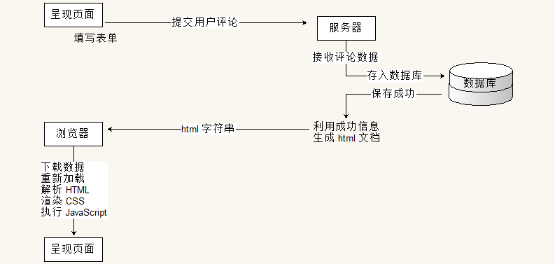
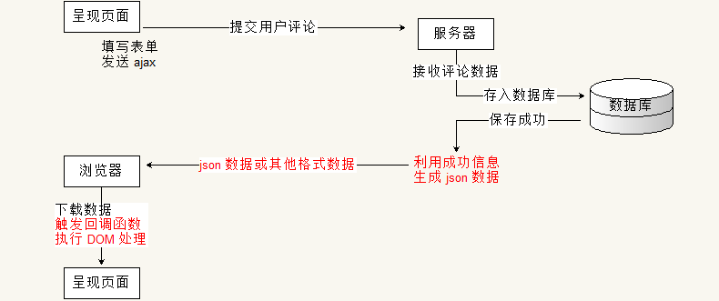
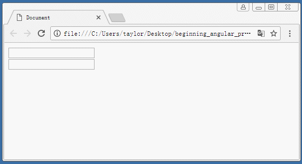
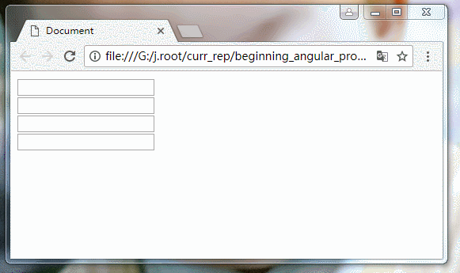
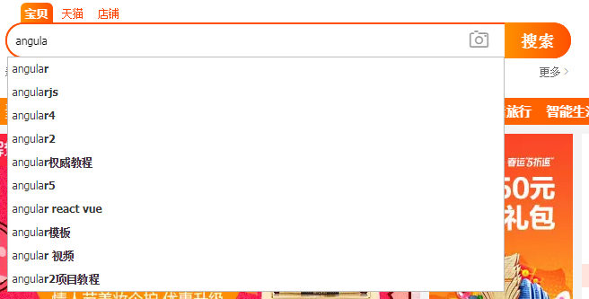
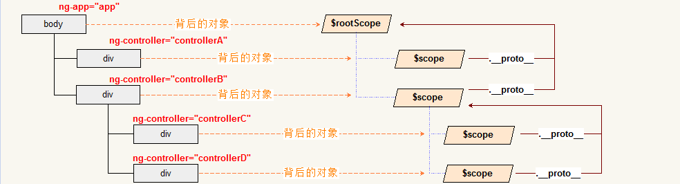
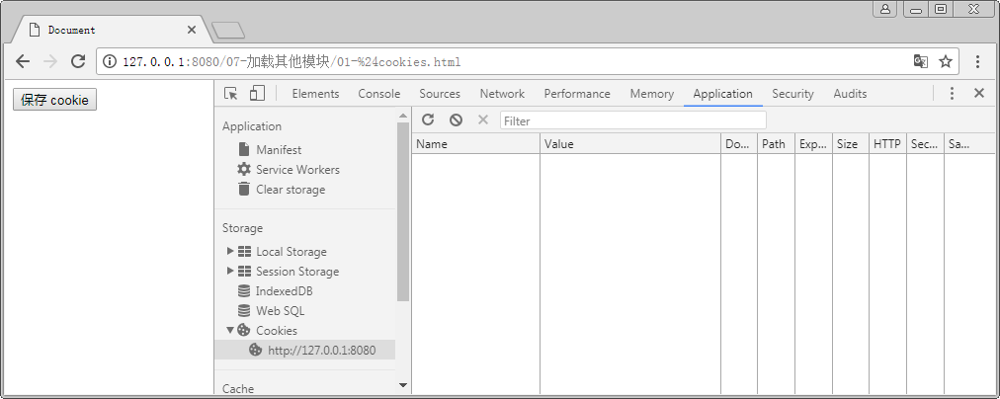
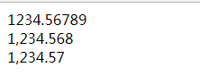
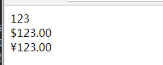

# 下载与文档

## 下载 angular

下载 angular( 后面简称为 ng )可以使用很多种方法:

- 使用 npm 下载
```
$ npm install angular --registry=https://registry.npm.taobao.org
```

- 使用 [CDN](http://www.bootcdn.cn/angular.js/1.6.8/)
```html
<script src="https://cdn.bootcss.com/angular.js/1.6.8/angular.js"></script>
<!-- 或 -->
<script src="https://cdn.bootcss.com/angular.js/1.6.8/angular.min.js"></script>
```
- 使用[官网](https://angularjs.org/)下载, 也可以进入所有的 release 版本的站点下载: [https://code.angularjs.org/](https://code.angularjs.org/)


注: 个人建议初学者在官网下载所有的包, 因为里面包含了所有的常用库, 以及文档内内容.


## 部署文档( 这里使用 1.6.8 为例 )

学习和使用 ng 的时候可以使用[在线文档](https://docs.angularjs.org/), 也可以在本地部署

- 下载完整的代码压缩包([angular-1.6.8.zip](https://code.angularjs.org/1.6.8/angular-1.6.8.zip))
- 解压, 然后在解压目录下可以看到一个 docs 文件夹. 里面放置的就是文档( 值得注意的是, 该文档需要依赖外部的代码 )
- 然后在解压的目录下部署 http 服务器即可. 


# 传统开发和 ng 以及 vue 的区别概述

## 传统开发

传统的 web 开发经历了好几个阶段
- 静态网站阶段
- 后台渲染动态网站阶段
- ajax 阶段( 前后台半分离阶段 )
- 前后分离阶段

### 静态网站阶段

早期的网络只是为了通信, 传递信息. 是专有网络. 所以也不存在信息身份验证等内容. 
仅仅使用静态网站展示需要显示的文字信息. 但是随着网络发展越来越快, 
静态网站已经不再满足现在的需求. 例如, 无法实现搜索, 登录等模型.

### 后台渲染动态网站阶段

为了实现动态网站, 需要将很多逻辑在服务器生成, 然后在根据需要生成相应的 HTML 页面( HTML 字符串 ).
然后由服务器返回给浏览器, 用户再查看页面. 


但是该模型使得每次索要数据都会进行一次请求与响应过程. 而浏览器只有使用 form, 表单提交来实现该功能.
那么就会造成一个较为不友好的方式: 页面重新加载. 试想一下, 在看到好电影时, 想要发表一个评论, 
提交后页面重新加载 ... 然后再等一分钟广告?



### ajax 阶段( 前后台半分离阶段 )

为了提高用户体验(在接收数据的时候, 浏览器不进行重新加载页面), Ajax 技术不断的被使用.
异步的提交请求, 不影响页面的正常显示与运行. 然后请求被服务器处理, 响应回来后触发一个回调函数,
在回调函数中利用 DOM 操作对页面进行处理.



随着移动端的慢慢兴起, 需要配合多个尺寸的客户端, 同时需要移动设备开启时有较好的用户体验, 
慢慢的需要将全台渲染完全从后台移到前台. 

- 传统后台提供数据与界面的代码, 因此分离后后台只需要提供数据, 将面渲染的行为交给前端(浏览器). 这样不仅降低了服务器压力, 也使得适配变得容易.
- 将界面的处理交给浏览器. 在移动设备上, 浏览器可以保存一部分数据. 在启动 app 的时候, 可以展示上次关闭时的界面, 同时异步请求最新数据.待请求数据返回后更新界面. 从而不会出现页面加载时的白屏, 提升用户体验.


### 前后分离阶段

前后分离是 web 开发的趋势. 将所有的界面交互与应用交给浏览器执行, 所有的数据加载都使用 ajax 异步请求. 第一次请求一个界面的外壳, 或许带有少量数据. 然后在使用过程中不断按需请求数据, 加载数据. 从而诞生单页面应用程序. 将整个 web 看成一个独立的 app.

将前端独立出来后, 诞生出大量前端框架, 提供一整个生态系统. 对于前端开发者, 重心可以更加专注与用户与界面.


## 传统开发与 angular 和 vue 的直观对比

angular 与 vue 属于一类框架( 也可以简单的称之为库, 解决方案等 ), 都属于 MV* 系列框架.
利用面向对象的方式去封装界面中的各种功能( 组件或模块 ). 

传统的页面操作( jQuery 时代 )是站在 DOM 模型的基础上, 将 html, 原本一个结构化字符串, 看成一棵对象树.
利用提供的 DOM 方法对树中的各个节点( node 节点 )进行增加节点, 删除节点, 修改节点属性或样式, 以及查询指定节点等操作.
从而实现界面的交互. 

例如目录展开, 利用的是点击事件加修改元素的 `display` 样式.

```javascript
var a_list = document.querySelectorAll( '.menu-title' );
Array.prototype.slice.call( a_list ).forEach(elem => {
    elem.onclick = function () {
        var ul = this.nextSibling.nextSibling;
        var classNames = ul.className.split( ' ' );
        var i = -1;
        if ( ( i = classNames.indexOf( 'hide' ) ) > -1 ) {
            classNames.splice( i, 1 );
        } else {
            classNames.push( 'hide' );
        }
        ul.className = classNames.join( ' ' );
    }
});
```

虽然传统的 DOM 操作也是在使用 面向对象. 但是其颗粒度非常的细. 它将每一个标签都看成对象, 所以对于较大的代码逻辑, 
实际操作起来依旧会很麻烦. 但是如果使用 MV* 的框架, 将整个逻辑单元看成对象( 一个对象中可能包含很多标签 ). 
例如还是以菜单为案例, 在 angular 或 vue 中, 可以将整个菜单看成对象. 而其中利用数据驱动界面这一特征, 
使得上述代码实现起来极为简单.

例如在 vue 中, html 部分( 片段 )为:

```html
<ul>
    <li id="app1"><a class="menu-title" v-on:click="myclick">一级菜单1</a>
        <ul v-show="ishide">
            <li>二级菜单1.1</li>
            <li>二级菜单1.2</li>
        </ul>
    </li>
    <li id="app2"><a class="menu-title" v-on:click="show = !show">一级菜单2</a>
        <ul v-show="show">
            <li>二级菜单2.1</li>
            <li>二级菜单2.2</li>
        </ul>
    </li>
</ul>
```

其代码为:

```javascript
new Vue({
    el: '#app1',
    data: {
        ishide: false
    },
    methods: {
        myclick: function () {
            this.ishide = !this.ishide;
        }
    }
});

new Vue({
    el: '#app2',
    data: {
        show: false
    }
});
```

angular 的实现更有意思, 可以不写一句 js 代码:

```html
<div ng-app ng-init="menu1 = menu2 = menu3 = false">
    <ul>
        <li><a class="menu-title" ng-click="menu1 = !menu1">一级菜单1</a>
            <ul ng-show="menu1">
                <li>二级菜单1.1</li>
                <li>二级菜单1.2</li>
            </ul>
        </li>
        <li><a class="menu-title" ng-click="menu2 = !menu2">一级菜单2</a>
            <ul ng-show="menu2">
                <li>二级菜单2.1</li>
                <li>二级菜单2.2</li>
            </ul>
        </li>
        <li><a class="menu-title" ng-click="menu3 = !menu3">一级菜单3</a>
            <ul ng-show="menu3">
                <li>二级菜单3.1</li>
                <li>二级菜单3.2</li>
            </ul>
        </li>
    </ul>
</div>
```

注意: 这里的代码逻辑可能让部分初学者不知所云, 这里不用担心, 后面我们会详细的加以说明.


在 MV* 框架中, 将整个菜单看成一个对象.在 angular 中( 由于该讲义为 ng 基础讲义, 这里用 angular 做说明 ), 
这个对象的显示范围由 `ng-app` 来标记, 凡是 `ng-app` 包含的范围都属于该对象所维护的区域. 

同时在 该对象中维护了三个属性, 分别是 `menu1`, `menu2`, 以及 `menu3`. 
在代码中使用 `ng-init` 将这三个变量初始化为 `false`. 实际上这个 `ng-init` 可以省略.

同时在这个对象中, 使用 `ng-click` 注册了三个点击事件, 在点击事件中, 对对应的变量取反. 即 `true` 变成 `false`,
而 `false` 变成 `true`. 

另外在子菜单上使用 `ng-show` 来根据对应的 变量 来控制当前标签是否显示.

如此, 只要点击对应的 `a` 标签, 就会触发相应的 `click` 事件, 即会将对应的 `menu` 变量取反.
同时由于对应的变量发生变化, 会随之将子菜单( 含有 `ng-show` 的标签 )的显示情况进行修改. 
如果变量为 `true` 则显示; 若变量为 `false` 则隐藏.


## MVVM 开发模型简述

angular 是一个 MVVM 的框架, 这里第一个 M 是 Model, 即模型, 是表示数据模型的含义. 
这里的第二个字符 V 是 View, 表示视图, 即用于显示的界面. 它一般是一个模板, 套用数据后就可以得到想要的显示.
接下来的 VM 是 ViewModel, 即视图模型. 用于联系视图与数据模型的桥梁. 一般用于控制显示. 

在 MV* 系列的概念中, 存在诸多争议, 实际上这些争议都是仁者见仁智者见智. 初学者不需要深究 MVC 还是 MVVM.
建立好操作模型比较重要. 

在 传统的 DOM 操作中, 重点在造作页面的步骤. 

- 找出需求, 抽象出数据模型.
- 然后确定需要处理什么元素, 接着找到该元素.
- 然后确定算法, 按照算法一步步操作元素.
- 最后再来决定是否需要优化.

也就是说, 传统的做法, 即使是使用 DOM 对象, 但是将重点依旧放在了处理步骤上, 还是采用的过程化思维.


而 MVVM 则不同, 它完全采用面向对象的思想. ng 中将需要处理的页面( `ng-app` 标记的标签 )看成一个模块( module, 
初学者直接将其与对象可以等同 ), 然后在模块中抽象出数据模型. 并在界面中使用各种指令( directive )来关联背后的对象.
angular 框架帮我们完成了关联与联动的任务, 我们不用关系其具体的实现. 
在使用 angular 框架后, 原本要操作界面 dom 的步骤转而变成操作背后的对象, 我们修改对象的属性或成员. angular 帮我们将这个修改作用到页面的 DOM 上, 从而实现: *操作背后的对象, 即操作界面的元素*. 

例如代码逻辑:

html 部分:

```html
<div ng-app="app">
    <input type="text" ng-model="txt" />
</div>
```

js 部分:

```javascript
angular.module( 'app', [] )
    .run(function ( $rootScope ) {
        $rootScope.txt = 'angular';
    });
```


使用 angular 后, 操作模型就变成下面的逻辑关系:


我们操作背后对象的 `text` 属性


会通知处于实时监视背后对象的 angular


然后 angular 会将数据的改变同步到界面中的对应位置


从而实现了操作对象, 然后对象帮我们操作页面这一逻辑. 


同时 angular 还提供了将界面的操作同步到背后的对象上的逻辑. 依旧采用该这个模型. 


在我们修改界面的数据后会触发 angular 的监听行为


从而将数据同步到背后的对象中. 以该代码为例, 背后的对象就是 `$rootScope`


这样就可以实现: 取页面中元素的数据, 可以直接从背后的对象上取得, 不需要处理 dom.


最终如果要验证, 我们可以将 `$rootScope` 映射到全局对象上来查看:


注意: 由于将 `$rootScope` 放到了 ng 结构的外部, 所以在数据修改后需要手动调用一个 `$apply()` 方法. 如果是在 ng 代码结构的内部就不需要. 这里的细节可以先暂时不考虑, 重点是思想, 代码编写思维的变化.


## 小结

本节我们讨论了传统开发与使用 angular 开发的区别. 
- 传统开发注重细节
- angular 是 MVVM 的框架, 将直接操作 DOM 转变成操作 对象, 而 ng 将这个操作同步到界面中
- 同时 ng 还提供将界面数据的修改同步到背后的对象上, 使得我们需要获得页面的数据, 可以直接从对象上取得.

同时抽象出来 MVVM 的模型图, 该图现在也许会对部分同学造成困惑, 可以先记住它, 在后续的代码中慢慢体会其意义:


# ng 基本模型

作为初学者使用 ng 的步骤可以归纳为:

- 引入 ng 包
```html
<script src="xxxx/angular.js"></script>
```
- 在页面中需要用 ng 处理的标签上写上 `ng-app="模块名"`. 此处的模块名与标识符的命名约定一样. 一般用于学习可以将 `ng-app` 写在 `body` 标签上.
- 在需要使用 ng 处理的代码上使用 `ng-model` 来关联前后的变量名, 该名字即会成为背后对象的属性, 即可实现前后数据的同步.
- 然后创建 `script` 标签, 并使用代码 `angular.module( '模块名', [] )`, 来创建模块. 其中模块名即为 `ng-app` 后面的名字, 而方法中紧跟的 `[]` 表示依赖模块. 后面会详细讨论到模块的依赖, 这里先空着. 
- `angular.module` 方法返回一个模块对象, 我们可以使用变量接收, 然后使用变量进行后续操作. 也可以使用链是编程, 来提供后面的代码处理.
```javascript
// 例如:
var app = angular.module( 'app', [] );
app.run( function ( $rootScope ) {
    $rootScope.text = '初始化文本';
});
// 亦或使用链是编程格式
angular.module( 'app', [] )
       .run(function ( $rootScope ) {
            $rootScope.text = '初始化文本';
        }); 
```

注意: 
- 上述方法也就是只是在演示 ng 的一般使用方法. 这个步骤是最简单的, 但是要灵活使用 ng 的各种功能, 我们还需要学习很多后续内容.
- 对于很多案例, ng 几乎可以不写任何代码. 但是这仅仅是在演示 ng 的强大, 没有实际意义. 实际开发是不会使用哪种什么 js 也不写的结构, 这个演示只是一个噱头而已.
- 页面上默认只允许有一个 `ng-app` 的属性, 所以不要创建多个. 按照 ng 的思想, 将一个页面看成一个 app, 一个大的对象.
- 在标签中写的, 诸如 `ng-xxx` 的属性被称为指令( directive ), 是 ng 强大的核心. ng 中大多数功能都是利用给标签添加指令来实现的. 所谓指令, 其实就是在说明某个标签需要执行某些额外的处理.
- 在 `run` 方法中回调函数的写法, 参数 `$rootScope` 也必须原样编写代码. 后面会解释为什么.

## 简单案例

在页面中显示一个文本框, 和一个按钮. 文本框默认显示 0, 点击按钮后文本框中的数字自动加一.

该案例的传统处理方法请读者自行实现, 以体会 ng 带来的好处, 具体代码可以参考 demo 文件夹.

下面用 ng 来实现, 首先我们考虑一下这个业务如何抽象出对象模型.

首先需要实现累加计算, 那么页面中的文本框, 就是需要与背后对象数据同步的结构. 因此在文本框中可以使用 `ng-model` 来提供数据的名字. 即背后的对象也会使用该名字. 例如:

```html
<body>
    <input type="text" ng-model="txt" /><button>click</button>
</body>
```

然后在点击按钮的时候会使得该数据变化, 也就是说要在按钮上绑定事件. 这里使用 ng 的事件指令 `ng-click`. 

它的用法与 `onclick` 类似. 在传统 `onclick` 的用法中有这样一种用法:

```html
<button onclick="alert( '点击了按钮' )">click</button>
```

在点击该按钮后, 会执行 click 事件, 即将 `onclick` 中的字符串作为代码来执行. 在逻辑上就好像写在 `onclick` 
中的字符串, 就是一个匿名函数一样. 在点击按钮的时候就会触发该事件, 即会调用该事件处理函数. 

同样在 ng 中, `ng-click` 的用法也是如此. 但是略有不同. 如果写成: 

```html
<button ng-click="myclick()">click</button>
```

代码在运行的时候, 字符串 `"myclick()"` 也会当做 "匿名函数" 来执行. 不同的是该匿名函数的上下文是我们前文中提到的 
"背后的对象". 

我们知道在 MVVM 中将 dom 操作转换成了对对象的操作, 也就是说在页面的背后会有一个对象. 我们在页面中使用的所有 
`ng-model` 提供的名字都是这个对象的属性. 同样我们使用 `ng-click` 里面的方法都是这个对象的方法. 

即这里使用 `<button ng-click="myclick()">click</button>` 表示背后的对象上有一个方法, 方法名为 `myclick`,
在点击该按钮后, 就会调用该对象的这个方法. 

综上我们可以得到一个对象结构:

```javascript
var $rootScope = {
    txt: 0,
    myclick: function () {
        // ...
    }
};
```

这个对象结构与前面的界面互相关联. 按照前面 MVVM 的逻辑, 凡是在页面中修改了文本框的内容, 
ng 就会把数据同步到该对象的 `txt` 属性上. 在界面上点击按钮, ng 就会触发调用 `myclick` 方法. 

反过来, 我们如果在 ng 代码中修改了 `txt` 属性, 即会将该属性值同步到 界面上. 
这里需要注意的是在 ng 的代码内部修改, 那么代码内部在哪呢? 看下面代码:

```javascript
angular.module( 'app', [] )
       .run( function ( $rootScope ) {
           // 哪里是 ng 内部???
       });
```

很显然, 所谓的 ng 代码内部就是在 run 方法参数中的这个回调函数里. 因此我们只需要在点击触发的 `myclick` 
方法里处理 `txt` 属性即可. 

综上所述, 代码可以写成:

```html
<body ng-app="app">
    <input type="text" ng-model="txt"><button ng-click="myclick()">click</button>
    <script>
        angular.module( 'app', [] )
               .run( function ( $rootScope ) {
                    $rootScope.txt = 0;
                    $rootScope.myclick = function () {
                        this.txt = this.txt - 0 + 1;
                    };
               });
    </script>
</body>
```

注意: 
- 在页面运行的时候, `run` 方法仅会调用一次, 所以可以将初始化的代码写在这里.
- 在该代码结构中可以看到方法 `myclick` 直接绑定到了 `$rootScope` 上, 也就是说其上下文( 就是 `this` )是 `$rootScope`. 
- 由于文本框中存储的是字符串, 所以要先减去 `0`, 以转换成数字后再加 `1`.


### 根据上述分析, 大家可以做一个练习

要求在页面中放置两个文本框, 对其中一个文本框输入数据, 另一个文本框同步该输入( 请先思考在实现, 不要看答案 ). 
演示效果如下:




## 一些简单结论

- 在 ng 中, 凡是在页面中使用了 `ng-app` 即在代码背后存在一个对象. 该对象就是 `$rootScope`.
- 在 ng 中, 凡是需要对页面中的数据进行操作, 都应该使用 `ng-model`, 将该操作转接到背后的对象上.
- 在 ng 中, 凡是使用了指令, 在指令中使用的内容似乎都应该是背后的对象 `$rootScope` 的属性或方法.


## 是否需要给 `ng-app` 提供数据


# 数据绑定与表达式

从前文的介绍中可以看到, 界面的 html 中可以使用 `ng-xxx` 的属性命名一些名字. 
然后背后的对象上维护对应的属性, 即可实现前后的同步.

这样将界面中的 "名字" 与背后的对象的绑定被称之为数据的绑定. 

在界面中使用 `ng-model`, 可以实现双向数据绑定. 即*界面修改同步背后属性修改, 背后属性修改同步界面修改*.


## `ng-bind` 单向数据绑定( data-bind )

在标签中还可以使用 `ng-bind` 来实现单向的绑定. 在界面中呈现数据, 往往是以展示数据为主( 这个看项目需求, 并非绝对 ).
例如展示数据列表, 某个页面的菜单, 某个网站的站点导航等. 这些数据不需要用户修改. 一般只有在表单处理, 
或需要记录数据的时候才需要用户输入. 

所以并非每一个标签中都要使用 `ng-model`, 如果只需要单向绑定. 即背后对象属性修改, 就触发前面界面的数据修改. 
那么可以使用 `ng-bind` 指令. 

它的使用与 `ng-model` 一模一样, 唯一不同的是, 不需要写到输入框中. 例如案例: 

```html
<body ng-app="app">
    <input type="text" ng-model="name"><br>
    你好, <span ng-bind="name"></span>
    <script>
        angular.module( 'app', [] )
                .run( function ( $rootScope ) {
                    $rootScope.name = 'jim';
                });
    </script>
</body>
```

分析:
- 在 `run` 方法中初始化对象 `$rootScope` 的 `name` 属性为 `'jim'`. 


- 对属性的设置触发 ng 将数据同步到界面中.
- 页面中使用 `ng-bind` 的标签内部会使用对应的数据进行填充( 注意, 默认不允许 html 字符串 ). 使用 `ng-model` 的输入框亦会如此.


- 在前台界面的文本框中输入数据的时候, 会触发 ng 将界面的数据变化记录下来, 并通知背后的对象.
- 将数据同步到背后的 `$rootScope` 对象的 `name` 属性上.


- 由于此同步使得 `$rootScope.name` 发生变化, 又会触发一次 ng 监视同步行为. 
- 将该数据同步到界面的 `ng-bind` 所在的标签中.
- 从后向前的同步会同时发生在 `ng-bind` 和 `ng-model` 上, 但是由于此次同步的数据, 与 `ng-model` 中的数据相同, 所以不会进行数据的修改, 也就不会再发生同步逻辑. 事实上, 如果依旧有数据变化, 还是会触发一次同步逻辑. 在 ng 中这个循环会在执行到 第 10 次的时候强制终结, 并抛出一个异常. 
- 由于 `ng-bind` 是单向数据绑定, 因此在界面中它的数据变化不会触发 angular 监视行为.


在 ng 中数据绑定的案例特别多. 除了使用 `ng-bind` 外, 在页面中还可以使用插值语法.

## 插值( interpolation )

在 ng 中提供一种插值语法. 默认使用双花括号括起来. 例如: 

```html
<p>你好, {{ name }}</p>
```

使用 `ng-bind` 固然很好, 但是在一些 DOM 属性中, 或是一些字符串中就无法使用了. 因为它必须写在标签上. 但是插值语法就要容易得多. 
例如刚才那个案例:

```html
<body ng-app ng-init="name='jim'">
    <input type="text" ng-model="name"/>
    <br />
    你好, {{ name }}
</body>
```

该代码的执行分析与上一个案例一致. 这里仅仅是在比较插值语法与 `ng-bind` 的方便之处.


## 表达式( expression )

在编程语言中, 表达式是由数据与运算符连接起来具有计算结果的语法结构, 或运算结构. 但是在 ng 中这一概念被推广.

在 [ng 官网文档](https://code.angularjs.org/1.5.11/docs/guide/expression)中这么定义:

<!-- 
Angular expressions are JavaScript-like code snippets that are mainly placed in interpolation bindings such as <span title="{{ attrBinding }}">{{ textBinding }}</span>, but also used directly in directive attributes such as ng-click="functionExpression()".
 -->

    Angular 表达式是一个类似于 JavaScript 的代码片段. 该代码片段主要用于数据绑定中插值的替换. 
    例如: <span title="{{ attrBinding }}">{{ textBinding }}</span>, 同时也用于指令属性中.
    例如: ng-click="functionExpression()"

换句话说, 我们之前使用的 `ng-bind`, `ng-click`, `ng-model` 等指令中的内容都是 angular 的表达式.

那么在 ng 中的表达式与 以前讨论的 javascript 的表达式有什么区别呢?

### 首先上下文不同

在 javascript 中, 一般表达式的上下文为全局的 `window`( 闭包中的除外 ). 例如调用一个函数, 
实际上是调用全局对象 `window` 的方法. 

而 ng 中, 上下文为当前标签背后的对象, 即前面讨论的 `$rootScope`. 所以常常出现的错误中有一个就是弄错了上下文. 

例如要实现两个文本框的自动求和的逻辑. 下面的代码就无法运行成功:

```html
<body ng-app>
    <input type="text" ng-model="num1">
    +
    <input type="text" ng-model="num2">
    =
    <span ng-bind=" parseInt( num1 ) + parseInt( num2 ) "></span>
</body>
```

这里运行没有结果, 原因是表达式中使用了 `parseInt`, 也就是说 ng 会假定该方法是 `$rootScope` 的.
但是很显然没有该方法, 古不会有任何结果. 这一点也是 ng 表达式的特点, 在表达式中, 处理了不存在的数据,
或调用了不存在的方法, 是不会报错的. 

如果将最后一句代码修改为下面的样子, 就可以得到结果了:

```html
<span ng-bind=" ( num1 - 0 ) + ( num2 - 0 ) "></span>
```

### 容错性

好比上一个特点中提到的, 在 ng 中, 如果一个数据为 `null`( 或 `undefined` ), 而求其属性的值, 
则会得到一个异常. 

但是在 ng 中, 无论是对象为 `null` 还是 `undefined`, 该计算都不会出现错误.

### ng 可以使用过滤器

在 ng 中含有一种特殊的语法, 允许在表达式中使用 过滤器( filter ). 所谓的过滤器, 是一种处理数据,
或格式化数据的函数. 它可以将数据处理成我们想要的形式. 例如下面代码: 

```html
<body ng-app ng-init="money=123">
    <p>{{ money }}</p>
    <p>{{ money | currency }}</p>
    <p>{{ money | currency: '¥' }}</p>
</body>
```

其运行结果为:


竖线是过滤器语法, 过滤器 `currency` 实际上是一个函数. 该函数提供两个参数, 
一个参数是竖线前面的值( 一般就是前面绑定的属性 ), 另一个参数是过滤器后面冒号后的参数.
该过滤器的目的是将数据以货币的形式进行输出, 即数字后需要带有两个小数位. 
同时在数字前面带有货币的类别字符. 如果 `currency` 后面没有参数, 即默认参数为美元符.

ng 支持很多过滤器, 还支持自定义过滤器. 至于过滤器的细节我们后面再讨论.


### 不允许流程控制

### 不允许函数定义

### 不允许包含正则字面量

### 不允许使用 new 关键字

### 不允许使用位运算, 逗号运算和 void 运算符


在 ng 表达式中有很多不允许, 大多数不允许是因为 ng 背后会利用词法分析的方式解析表达式.
而流程控制, 斜线, new 等内容都会影响到解析的算法. 至于不允许使用位运算符, 
是因为 竖线已经是过滤器的语法结构了.

一般正常使用表达式不会有什么问题. 核心需要注意的是 ng 中表达式中的每一个标识符, 都会对应背后对象的属性.


# 常用内置指令

所谓的指令( directive ), 就是额外需要执行代码的标记. 
ng 中我们已经接触过的指令有: `ng-app`, `ng-init`, `ng-model`, `ng-bind`, `ng-show`, `ng-click` 等.

指令就是额外需要执行的标记, 例如 `ng-app` 一写, 就会使 ng 将该标签以及其所有子标签作为维护的标签, 
同时背后就会创建一个维护的对象. 

再如, `ng-init` 表示初始化, 凡是在该指令中写的赋值逻辑, 都会在背后的对象中初始化对应的属性.

又如 `ng-model`, 凡是出现在其中的标识符, 都会在背后提供对应属性. 同时 ng 会自动帮助我们添加事件与监听的方法. 
只要一侧数据发生变化就会触发同步.

...

综上所述, 凡是写到指令的地方, 就是在该范围内需要额外的执行逻辑. 

在 ng 中还有很多的指令. ng 中指令有四种形式:

- 以属性的形式存在. 前面接触的指令均是如此.
- 以标签的形式存在. 例如 `ng-view` 等, 后面会陆续说明.
- 以 class 的形式存在. 这个相对使用较少.
- 以注释的形式存在. 这个我们自己使用的较少.

接下来我们一一举例说明常用的指令( **该部分只会介绍该阶段可以使用的指令, 部分指令还需要后续内容支撑** ).

可以参考[文档](https://docs.angularjs.org)中的 directive 部分 


## 控制指令

这里我们介绍 `ngIf` 和 `ngRepeat` 指令的用法.

> 注意: 在 ng 中, 所有的指令描述都采用 骆驼命名规则. 但是在 html 中使用的时候, 均采用 连字符 连接的小写字符形式.


### ngIf 指令

该指令语法:

```html
<tag ng-if="表达式">...</tag>
```

其含义为, 如果 `ng-if` 中绑定的数据, 表达式的值如果为 `true`, 则表示该标签会呈现在 DOM 结构中.
若该表达式的值为 `false`, 则该标签就不会出现在 DOM 树中. 注意不是隐藏, 是根本就不会出现在 DOM 结构中.

看下面代码:

```html
<body ng-app>
    <div ng-if="exist">
        测试数据
    </div>
</body>
```

运行查看代码的 DOM 结构:


简单分析:
- 页面加载运行, 由于 `ng-app` 后面没有提供任何名字. 因此 我们不用编写任何代码, ng 会自动维护一个背后的对象.
- 由于标签中没有提供 `ng-init` 指令, 所以在背后对象中, 没任何成员.
- 而标签中的 `ng-if` 指令中使用了 表达式 `exist`, 而背后的对象中又没有该属性, 即表达式的值为 `undefined`
- 因此 `ng-if` 表达式的值为 `false`, DOM 结构中不会提供该节点.

如果在代码中加上下面代码结果会怎样呢? 请自行分析运行的原理.

```html
...
<body ng-app ng-init="exist=1">
...
```


### ngRepeat 指令

`ng-repeat` 指令允许在页面中利用数据构造结构重复的标签. 例如菜单结构, 表格结构, 选项卡结构等.
其语法为:

```html
<tag ng-repeat="迭代变量 in 集合">...</tag>
```

需要哪一个标签重复生成, 这个指令就放到哪一个标签上. 例如需要生成一个 `ul-li` 的列表, 需要利用数组重复生成 `li` 标签,
那么就需要将 该指令 放在 `li` 标签上( 注意不是放在 `ul` 标签上 ).

在 `ng-repeat` 的表达式中, '集合' 就是背后对象的成员. 而迭代变量有用户自己定义(需要满足标识符规则), 
类似于 js 中 for-in 循环语法. 该变量会在循环生成 `li` 标签的时候使用.

例如我们需要利用一个数组生成一个 `ul-li` 标签.

```html
<body ng-app="app">
    <ul>
        <li ng-repeat="item in list">{{ item }}</li>
    </ul>
    <script>
        angular.module( 'app', [] )
            .run(function ( $rootScope ) {
                $rootScope.list = [ 1, 2, 3 ];
            });
    </script>
</body>
```

其运行结果为:


简单分析:

- 首先我们手动创建了一个模块, 并在背后的 `$rootScope` 对象上提供了 一个 属性 `list`, 里面存储数据 1, 2, 3.
- 然后页面中使用 `ng-repeat` 指令. 该指令遍历 `list`. 
- 根据前文的说明, 凡是需要使用的名字都是背后对象的属性, 因此就是在遍历 数组 `[ 1, 2, 3 ]`.
- 每一次遍历都会创建一个临时变量 `item`, 我们称其为迭代变量. 由于数组中有三个数据, 因此会进行三次遍历, 每次 `item` 变量中存储的数据分别为 `1`, `2`, 和 `3`.
- 进行三次遍历就会创建 3 个 `<li>` 标签. 标签中利用插值将 item 的数据存储到 `li` 内.


我们再来看一个较为复杂的案例:

我们有一个数据结构:

```javascript
var data = [
    { title: '学习', submenus: [
        { title: '传智播客', link: 'http://www.itcast.cn/' },
        { title: '黑马程序员', link: 'http://www.itheima.com/' },
        { title: '博学谷', link: 'https://www.boxuegu.com/' },
        { title: '传智专修学院', link: 'http://www.czxy.com/' }
    ] },
    { title: '前端项目', submenus: [
        { title: 'mdn-js', link: 'https://developer.mozilla.org/zh-CN/docs/Web/JavaScript' },
        { title: 'jquery', link: 'http://jquery.com/' },
        { title: 'node', link: 'https://nodejs.org/en/' },
        { title: 'vue', link: 'https://cn.vuejs.org/' },
        { title: 'angular', link: 'http://angular.org/' },
        { title: 'react', link: 'https://reactjs.org/' },
        { title: 'git', link: 'https://github.com/' }
    ] },
    { title: 'BAT', submenus: [
        { title: '百度', link: 'https://www.baidu.com/' },
        { title: '阿里', link: 'https://www.aliyun.com' },
        { title: '腾讯', link: 'http://www.qq.com/' } 
    ] }
];
```

要求利用 ng 来生成一个菜单. 效果如图:


其 HTML 结构为: 


其代码的实现为:

```html
<body ng-app="app">
    <div class="menu">
        <ul>
            <li ng-repeat="item in list">
                <a href="#">{{ item.title }}</a>
                <ul class="submenu">
                    <li ng-repeat="subitem in item.submenus">
                        <a href="{{ submenu.link }}" target="_blank">{{ subitem.title }}</a>
                    </li>
                </ul>
            </li>
        </ul>
    </div>
    <script>
        angular.module( 'app', [] )
            .run(function ( $rootScope ) {
                $rootScope.list = data;
            });
    </script>
</body>
```

其运行的原理与过程请自行分析.


### 内置的迭代成员

使用 `ng-repeat` 的时候, 使用迭代变量来提供标签的数据. 这里的迭代变量就是集合中的数据.
例如数值数组, 迭代变量就是里面的数据; 对象数组, 迭代变量就是数组中的对象. 
如果需要使用其他的迭代数据, 例如遍历的序号等. ng 提供了一套内置的迭代成员.

|内置变量|类型|描述|
|:--|:--|:--|
|$index|数字(从 0 开始)|用于在迭代的过程中记录遍历时的序号(索引). 好比 `for` 循环中的 `i`|
|$first|布尔类型|用于判断当前项是否为第 0 项|
|$middle|布尔类型|用于判断当前项是否为中间的项( 0 项与最后一项之间 ).|
|$last|布尔类型|用于判断当前项是否为最后一项|
|$even|布尔类型|用于判断当前项是否为偶数项|
|$odd|布尔类型|用于判断当前项是否为奇数项|


## 事件相关指令

前文已经介绍过的事件相关的指令有 `ng-click`, 我们简要复习一下其用法.
- 首先该指令的用法与时间类似, 写在 该指令中的字符串会作为代码进行执行
- 在该指令中一般写上方法的调用语法, 或直接进行数据赋值等操作.
- 而该指令中的名字( 标识符 )或方法调用, 其名字都是 背后对象的成员.

配合 `ng-if` 可以控制点击行为, 来使得某些标签移除与添加. 例如:

```html
<body ng-app>
    <a href="#" ng-click="exit != exit">点击测试</a>
    <ul ng-if="exit">
        <li><a href="#">数据数据</a></li>
        <li><a href="#">数据数据</a></li>
        <li><a href="#">数据数据</a></li>
    </ul>
</body>
```

其运行效果为:


ng 中提供了很多类似的事件指令, 结合多个指令混合到一起使用会变得非常强大.

常见的事件指令有:

```javascript
    ngChange
    ngClick
    ngDblclick
    ngMousedown
    ngMouseup
    ngMouseover
    ngMouseenter
    ngMouseleave
    ngMousemove
    ngKeydown
    ngKeyup
    ngKeypress
    ngSubmit
    ngFocus
    ngBlur
    ngCopy
    ngCut
    ngPaste
```

其用法与 `ng-click` 一样, 意义如字面一样. 

下面我们看一个案例, 效果如下: 


提供的数据如下:

```javascript
var data = [ {   
    name: '纪明杰', 
    gender: 'm', 
    birthdate: '1973-3-31', 
    join: '2005-1-15', 
    address: '四川省  阿坝藏族羌族自治州', 
    email: 'Corey19730331@yahoo.cn', 
    phone: '13198561347' 
}, { 
    name: '邓健柏', 
    gender: 'm', 
    birthdate: '1975-11-30',
    join: '2008-1-15',
    address: '广东省  潮州市', 
    email: 'Andrew19751130@yeah.net', 
    phone: '13888543794' 
}, { 
    name: '濮阳语儿',
    gender: 'f',
    birthdate: '1984-1-31',
    join: '2012-5-15',
    address: '安徽省  巢湖市', 
    email: 'Charlotte19840131@yahoo.cn', 
    phone: '13918704172' 
}, { 
    name: '嵇志强', 
    gender: 'm', 
    birthdate: '1979-7-31', 
    join: '2007-12-15',
    address: '河南省  漯河市', 
    email: 'Levi19790731@21cn.com',
    phone: '15918104461' },
{ 
    name: '居博超', 
    gender: 'm', 
    birthdate: '1986-12-31',
    join: '2008-5-15',
    address: '江苏省  南通市', 
    email: 'Enoch19861231@yahoo.com.cn', 
    phone: '13825143219' 
}, { 
    name: '窦弘文', 
    gender: 'm', 
    birthdate: '1974-2-28', 
    join: '2007-5-15', 
    address: '贵州省  安顺市', 
    email: 'Bartholomew19740228@yeah.net', 
    phone: '15953281032' 
}, { 
    name: '邰浩然', 
    gender: 'm', 
    birthdate: '1989-4-30', 
    join: '2009-2-15', 
    address: '广东省  茂名市', 
    email: 'King19890430@yahoo.com.cn', 
    phone: '13824309057' 
}, { 
    name: '弓天磊', 
    gender: 'm', 
    birthdate: '1986-12-31',
    join: '2005-11-15', 
    address: '安徽省  黄山市', 
    email: 'Bowen19861231@yahoo.cn', 
    phone: '15844437988' 
} ]; 
```


简要分析实现过程:

- 首先根据数据可以看到是一个数组, 因此可以构造表格结构.

```html
<table border="1" width="1200">
    <thead>
        <tr>
            <th>编号</th>
            <th>姓名</th>
            <th>性别</th>
            <th>出生年月</th>
            <th>入职时间</th>
            <th>家庭住址</th>
            <th>邮箱</th>
            <th>电话</th>
        </tr>
    </thead>
    <tbody>
        <tr ng-repeat="item in list">...</tr>
    </tbody>
</table>
```

- 考虑到 data 数组中的项是一个对象, 因此利用 `item` 引用该项这一特点, 可以开始写 `<tr>` 中数据的模板. 利用内置变量 `$index` 来输出序号.

```html
<tr ng-repeat="item in list">
    <td>{{ $index }}</td>
    <td>{{ item.name }}</td>
    <td>{{ item.gender }}</td>
    <td>{{ item.birthdate }}</td>
    <td>{{ item.join }}</td>
    <td>{{ item.address }}</td>
    <td>{{ item.email }}</td>
    <td>{{ item.phone }}</td>
</tr>
```

- 需要让鼠标悬浮的时候高量, 可以提供一个类样式

```css
.light {
    background-color: yellow;
}
```

- 需要显示高亮, 只需要提供 `class="light"` 的类样式即可.
- 但是需要鼠标悬浮才有该样式, 鼠标移开移除该类样式, 所以可以用背后的对象维护一个变量 `over`, 表示是否鼠标悬浮.
- 在 `<tr>` 上使用 `ng-mouseover` 与 `ng-mouseleave` 指令, 来给 `over` 提供数据

```html
<tr ng-repeat="item in list" 
    ng-mouseover="over = 1" 
    ng-mouseleave="over = 0" 
    class="{{ over ? 'light' : '' }}">
```

- 然后在代码中创建模块, 给 `$rootScope` 提供 `list` 成员

```javascript
angular.module( 'app', [] )
    .run( function ( $rootScope ) {
        $rootScope.list = data;
    });
```

- 最后运行即可. 

ng 的所有事件指令的使用, 实际上与一般 dom 提供的事件使用方法是一样的.


# 常用内置指令( 续 )

接下来继续讨论内置指令: 

<!-- ## 属性与样式指令

所谓的属性指令, 是说原本标签就有的属性, 但是在 ng 环境中原有属性的使用会出现问题, 所以 ng 对部分属性进行了封装,
得到了一些属性指令. 它们包括: `ng-href`, `ng-src`. 
事实上, 样式也是属性中的一种, 只是使用的过于频繁, 所以我们将其单独分类, 它包括: `ngClass`, `ngCloak`, `ngShow`, `ngHide`, 和 `ngStyle`. -->

## `ng-href` 与 `ng-src` 指令

这些指令的只用与标签属性的使用一样, 但是功能会更加 "智能" 点. 
例如在 ng 中如果需要设置一张图片的地址, 可以将代码写成: 

```html

```

但是 ng 的执行是需要时间的, 浏览器先要下载 html, css, js 等文件, 然后下载这些文件后, 需要解析 html, 
渲染 css, 同时要执行 js 代码. ng 的代码如果需要从网络中下载执行就会需要花费一些时间( 因为 ng 的库相对较大, 
而且需要配合网速, 网速一般是不确定的 ). 所以如果在 ng 执行结束之前, 在页面中图片就不会显示出来, 甚至显示一个错误的图片效果. 例如:


所以为了提高用户的体验, 应该更换成 `ng-src` 指令, 写成: 

```html

```

那么在 ng 程序执行结束之前, `img` 标签是没有 `src` 属性的, 也就不会发送图片请求. 在 ng 程序运行结束后,
背后的对象就会含有 `imgUrl` 属性, 同时含有数据. 同时 ng 就会将 `img` 标签的 `ng-src` 属性替换成 `src`
属性, 浏览器再发送图片请求, 从而显示图片.

`ng-href` 指令的用法与 `ng-src` 指令的用法是一样的.


## 样式相关指令

实际上设置标签的样式可以直接使用:

```html
<tag class="{{ className }}">...</tag>
<tag style="{{ styleValue }}">...</tag>
```

不过 ng 提供了更加好用的对应指令. 它们分别是: `ngClass`, `ngStyle`, `ngCloak`, `ngShow`, `ngHide`.

### `ng-class` 指令

该指令的语法为:

```html
<tag ng-class="表达式">...</tag>
```

说明:
- `ng-class` 指令有三种用法: 字符串, 对象, 或数组.
- 如果表达式的结果是一个字符串, 那么字符串可以使用一个用空格分隔开的各个类样式的名字.
- 如果表达式的结果是一个对象, 那么该对象的每一个键值对用于表示该标签可以使用的类样式. 键值为 `true` 的键名会作为类样式的名字用于该标签.
- 如果表达式的结果是一个数组, 那么数组的元素必然是第一种或第二种情况.

使用案例: (略)

### `ng-Style` 指令

该指令的语法为:

```html
<tag ng-style="表达式">...</tag>
```

说明:
- 表达式的结果应该是一个对象, 对象的键值对构成 css 的样式属性与对应的值

使用案例: (略)

<!-- ## 表单指令 -->


<!-- ## 其他指令 -->


# 控制器( controller )与作用域( scope )

我们首先来看一个案例:



在该案例中有两组输入框, 每一组输入框由两个文本框组成. 每一组都有一个功能, 就是输入其中一个文本框,
另一个文本框会同步数据; 若对另一个文本框做同样的事情, 对应的文本框也会提供数据的同步. 
思考一下这个怎么实现呢?

核心并不是如何实现, 因为按照前问的介绍, 只需要在 `$rootScope` 上维护两个属性, 然后每组文本框维护一个属性即可.
但是这并不是重点. 重点是对于复杂的页面逻辑, 例如类似于京东, 淘宝这样的网站界面, 每一个页面中包含很多独立的逻辑部分.
看下面的图:


在页面中含有多个部分: 搜索框部分, 菜单栏部分, 轮播图部分, 便捷操作部分 等. 每一个部分都有独立的功能:

- 搜索框输入数据会理解给出推荐词汇, 或搜索词频较高的推荐词. 例如:



- 菜单栏在鼠标移入的时候会自动打开对应的二级菜单.


- 轮播图会在规定时间内自动的进行切换, 同时在鼠标进入后计时器会停止, 在鼠标移开后, 计时器又会工作.


- 而便捷操作会提供用户的的一些便民操作, 例如充话费, 新闻, 旅行, 关注等内容.

*可见在很多实际的案例中, 一个页面包含多个部分, 而每一个部分都是独立的, 它维护自己的一套逻辑与功能. 同时各个部分之间功能上一般没有关系, 但是可以共享数据.*

再回到前面的案例中, 我们可以发现, 两组文本框可以看成两个独立的业务逻辑. 要维护业务逻辑, 可以在 `$rootScope` 中定义多个变量来统一维护.
但是这样也会造成混乱: 多个业务逻辑的数据混合在一起, 都挂载到 `$rootScope` 上, 完全不加以区分. 
因此, 我们需要将其分开, 让各个功能互相独立起来. 同时每一个功能部分维护一个类似于 `$rootScope` 的对象, 每一个部分同样支持双向数据绑定.
然而每一个部分都是独立的逻辑结构, 独立的业务.

为了实现这个要求, 我们引入控制器( controller ).


## 控制器( controller )

在 ng 中将整个页面看成一个对象( 使用 `ng-app` 标记 ), 同时在 app 的内部可以包含多个控制器( controller ). 
控制器的作用是将整个用 `ng-app` 维护的页面分解成多个部分, 每一个部分在逻辑上也是一个独立的 app( 类比 ). 
可以将整个 `ng-app` 维护的部分看成一个公司, 而每一个控制器部分是公司内的各个独立的部门.

每一个部门也有员工, 管理者, 是一个独立运营的结构. 但是一个公司的所有部门又组成整个公司. 
类似的, 每一个控制器是独立的运行部分. 按照前文的介绍, 就是含有独立双向数据绑定的结构.
而所有的控制器又包含在 `ng-app` 中, 属于其下的结构. 这样就可以在一个 `ng-app` 中维护多个独立的部分了.
这样也就可以轻松构建结构更加复杂的页面了.

### 创建控制器

控制器是一个独立的结构, 所以也是由界面上的 html 和背后的对象所构成. 创建控制器可以使用下列步骤:

- 在页面中的对应标签处使用指令: `ng-controller="controllerName"`, 提供控制器的名字.
- 然后在背后的代码中, 使用模块的 `controller` 方法来创建对应的控制器. 代码如下
```javascript
    module.controller( 'controllerName', function ( $scope ) {
        // ...
    });
```
- 在这段代码中, 需要提供这个控制器对应的 HTML 上使用的名字, 然后提供一个函数, 这个函数类似于前面 `run` 方法中的函数.
- 这样回调函数中的 `$scope` 类似于前面的 `$rootScope`, 就是在当前控制器描述的标签结构的背后的对象.
- 注意此时的回调函数中的参数不能做任何更改, 必须原样书写.

### 使用案例

创建一个控制器, 来维护双向数据绑定.

- 引入 ng 的 js 库, 然后在页面中添加 `ng-app` 和 `ng-controller` 指令, 并同时提供名字.

```html
<body ng-app="app">
    <div ng-controller="controller">
    </div>
</body>
```

- 在标签中提供两个文本框, 同时提供 `ng-model` 指令, 实现数据绑定

```html
<body ng-app="app">
    <div ng-controller="controller">
        <input type="text" ng-model="txt"><br />
        <input type="text" ng-model="txt">
    </div>
</body>
```

- 提供 `<script>` 标签, 然后添加创建模块与创建控制器的代码:

```javascript
    angular.module( 'app', [] )
        .controller( 'controller', function ( $scope ) {
        });
```

- 这里不需要使用 `$rootScope`, 因此也就不需要提供 `run` 方法. ( 当然你要是添加也无妨 )


大家可以运行一下这段代码, 看看有什么效果. 类似的我们也可以在页面中创建多个控制器, 独立的维护多个页面模块.


## scope

在引入控制器后, 我们的页面结构就变成如下结构:


事实上, 页面中的所有 scope 也有一个隐含的关系: 

- 所有的 `$scope` 都是直接或间接原型继承自 `$rootScope` 的.
- 在页面中如果有嵌套的 控制器, 内部控制器的 `$scope` 原型继承自外层控制器的 `$scope`.
- 所有同级的 控制器, 其背后维护的 `$scope` 是互相独立的对象.

即如果有下面代码:

```html
<body ng-app="app">
    <div ng-controller="controllerA">
        ...
    </div>
    <div ng-controller="controllerB">
        <div ng-controller="controllerC">
            ...
        </div>
        <div ng-controller="controllerD">
            ...
        </div>
    </div>
</body>
```

DOM 树结构与背后对象的继承结构关系为:



那么按照这个继承结构, 根据属性搜索原则, 成员的访问就可以通过原型链来访问.


# 服务与依赖注入

在 ng 中除了提供双向数据绑定的功能外, 还有其他常见的功能, 例如: cookie 与 localStorage 的存取, http ajax 请求,
location 处理, filter 功能等. 

对弈与以往开发模型, 如果需要提供新的功能, 无非就是引入新的 js 文件. 
但是在 ng 中不完全相同. 在 ng 中使用模块的概念, 对不同功能进行了封装( 打包 ). 
而模块, 我们可以看成一类功能打包的整体. 

那么, 在 ng 中如何使用这些打包的功能呢? 我们从以下几个方面来理解:

1. 不同的功能已什么方式存在?
2. 如何加载其他功能?
3. 模块中可以包含什么?
4. 如何加载模块?


## 服务( Service )

在 ng 中, 大量应用了面向对象的思想. 要使用特定的功能, 实际上就是调用特定的函数( 或 方法 ).
在 ng 中将不同的方法, 按照功能进行了分类, 并封装到指定的对象中, 并按照功能给对象命名. 
例如: 要进行地址栏的变更, 可以使用 location 对象. 要发送 ajax 请求, 则使用 http 对象. 
若要对插值的数据进行特殊语法过滤或转换, 则使用 filter 对象. 
总而言之, 要使用不同的方法, 就找不同的对象. 

在 ng 中, 这样包含了特定功能方法, 并给核心模态提供方法支持的对象, 我们称其为服务( services ).

事实上, 在 ng 中, `$rootScope` 以及其他 `$scope` 都是服务. 因为它们都是对象, 同时含有方法, 含有属性.
我们在使用双向数据绑定的时候, 需要使用这样的对象: 它们提供数据与行为的双向绑定功能.


## 依赖注入

在 ng 中, 如果需要使用某个服务, 实际上就是在 `scope` 上需要使用某一个服务. 
它有一个特殊的语法:

```javascript
    module.run( [ '$rootScope', '其他服务的名字', ..., function ( $rootScope, 其他服务的引用, ... ) {
        // ...
    } ] );
```

或者

```javascript
    module.controller( '控制器名',  [ '$scope', '其他服务的名字', ... function ( $scope, 其他服务的引用, ... ) {
        // ...
    } ] );
```

上面的语法似曾相识, 但又不完全一样. 原因是, 我们以前一直写成:

```javascript
    module.run( function ( $rootScope ) {
        // ...
    });
```

以及

```javascript
    module.controller( '控制器名', function( $scope ) {
        // ...
    });
```

前面我们提到过, 对于上面的代码, 函数内的所有写法不能修改. 
实际上在 ng 内部, 就是利用上面函数的参数名字, 来获得 ng 内部定义的同名的服务对象的.
也就是说, 回调函数写成:

```javascript
    function ( $scope, $filter, $location ) {
        // ...
    }
```

在 ng 执行的时候, 会将该函数先转换成字符串, 再利用正则表达式将函数内的参数名以字符串的形式获取出来.

```javascript
var rnames = /function.+\((.+?)\)\s*\{/; 
var m = rnames.exec( callback );
var serviceNames = m[ 1 ].split( ',' ).map( name => name.trim() );
```

利用上述代码, 即可获得对应的服务的名字, 然后将 ng 内部对应名字的服务取出, 传入到函数中直接使用. 
若 ng 内部找不到对应的服务名, 则会报错.

所以在前面使用 `$rootScope` 以及 `$scope` 的时候, 函数的参数不能随意更改既是该原因.

而其根本的实现, 就是本节给出来的语法形式. 我们以前的使用方式只是一种简化的写法, 其目的是为了方便使用.
而不允许修改函数参数的名字, 是因为一旦修改名字, ng 就无法找到对应名字的服务了.
事实上, 实际应用中, js 代码会被压缩, 而函数参数的名字也会随之更改与变短. 
因此之前的写法必须替换成本节开始描述的语法形式.

```javascript
[ '$scope', function ( $scope ) {
    // ...
}]
```

使用这个语法后, 传入的参数是一个数组. 数组的最后一个参数就是需要调用的函数, 数组的其他参数是指需要传入到函数中对象的名字.
数组除了最后一个函数外, 其他项的书写顺序就是最终传入函数的参数的顺序. 也就是说在 ng 内部会使用如下方式调用该数组: 

```javascript
var arr = 对应的数组;
var callback = arr.pop();
var services = arr.map( name => {
    return 找到 name 对应的对象( 就是服务 )
});

callback.apply( null, services ); // 这里的 null 只是一个占位符
```

也就是说, 在调用函数的时候传入的参数, 实际上是 ng 中的其他服务( 可以是内置的, 也可以是自定义的 ).
这样, 在方法中将需要的服务作为参数的方式传入到函数中, 按照需要就传入, 不需要就不传入的思想来使用这些对象. 
我们将这样的方式称之为 "依赖注入". 

所以对于简单的写法 ng 内部会获得函数的参数, 但是使用数组语法后, 函数参数就可以随意定义了.

这里的依赖就是说使用服务提供的方法来完成功能, 即依赖与服务对象( service object ).
而所谓的注入, 其实就是传入参数. 


## 常用服务举例

下面我们列举一些常见服务使用方法.

### $internal

首先介绍一下与 `window.setInterval` 方法对应的服务 `$interval`. 在 ng 中所有的东西都应该按照 ng 的逻辑来使用.
不应该在代码中使用 `window` 全局对象的方法, 而是应该利用依赖注入的方式将需要的东西注入到函数中( 就是传入函数中 ).
实施上, ng 中对 js 的 `window` 对象也实施了包装, 即为 `$window` 服务.

```javascript
    angular.module( 'app', [] )
        .run( [ '$window', function ( w ) {
            console.log( w === window ); // => true
        } ] );
```

而 `$interval` 的服务就是对 `setInterval` 函数的封装. 

首先 `$interval` 是一个函数, 其用法与 `setInterval` 函数几乎一样:

```javascript
    $interval( function () {
        // ...
    }, 时间间隔 );
```

但是 `$interval` 返回的是一个 Promise 对象. 使用 `$interval.cancel( <promise> )` 方法来结束该计时器.

首先来看这段代码:

```html
<body ng-app="app">
    <input type="text" ng-model="num">
</body>
<script>    
    angular.module( 'app', [] )
        .run([ '$rootScope', function ( $rootScope ) {
            var index = 0;
            setInterval(function () {
                index++;
                console.log( index );
                $rootScope.num = index;
            }, 1000);
        }]);
</script>
```

运行起来, 计时器会运行, 但是不会同步到页面中, 如果需要同步, 必须手动调用 `$rootScope` 的 `$apply()` 方法.
这是我们不希望看到的. 那么使用 `$interval` 服务即可:

```html
<body ng-app="app">
    <input type="text" ng-model="num">
</body>
<script>    
    angular.module( 'app', [] )
        .run([ '$rootScope', '$interval', function ( $rootScope, $interval ) {
            var index = 0;
            $interval(function () {
                index++;
                console.log( index );
                $rootScope.num = index;
            }, 1000);
        }]);
</script>
```

这样就可以实现计时器功能了.


### $http

在 ng 中, `$http` 服务提供了对 ajax 请求的封装. 一般的使用语法是:

```javascript
$http({
    method: 'GET',
    url: '...'
}).then(function successCallback( data ) {
    // 请求成功. 返回的数据在 data.data 属性中
}, function errorCallback( data ) {
    // 请求失败.
})
```

这里, 回调函数的参数 `data` 提供的属性, 常用的有:

- `data`. 用于返回响应的数据.
- `status`. 用于返回响应状态码.
- `statusText`. 用于返回响应状态文本.


同时在 ng 中提供了很多快捷方法.

- `$http.get`
- `$http.post`

对于其详细用法, 可以[参考文档](https://code.angularjs.org/1.5.11/docs/api/ng/service/$http).


## 自定义服务

自定义服务就是在自己定义对象, 封装自己的数据与方法. 然后利用依赖注入的方式将对象加到对应的函数中使用.

自定义服务的语法有 5 种, 分别是:
- `factory` 方法
- `service` 方法
- `constant` 方法
- `value` 方法
- `provider` 方法

### `factory` 方法

`factory` 即工厂, 该方法用于创造一个服务对象, 使用起来也很简单. 基本语法为:

```javascript
    module.factory( '服务名', [ function () { // 允许依赖注入
        return 对象;
    }] );
```

- 工厂就是用来生产的, 所以该方法中的回调函数, 只需要返回需要创建的服务即可.
- ng 的一大特点就是依赖注入, 因此在定义该服务的时候, 如果需要使用其他服务, 也是可以依赖注入的.
- 由于服务只是用于提供某些功能的工具对象, 服务在 ng 中都是单例的, 所以该方法也只会调用一次( 注意 ).


### `service` 方法

`service` 方法应该来说是 ng 的 "正统方法". ng 中一般什么东西就有对应的什么方法. 
例如, 创建控制器, 就有 `controller` 方法; 后面会介绍过滤器, 就有 `filter` 方法;
要创建指令, 就需要使用 `directive` 方法等. 所以要创建服务, `service` 方法更加贴切.

不过在使用上 `service` 不及 `factory` 来的简单. 其使用语法为:

```javascript
    module.service( '服务的名字', 构造函数 );
```

- `service` 方法接收的是一个构造函数, 也就是说在 ng 内部会将其 `new` 出来. 
- 利用这个方式创建服务, 可以使用 面向对象的诸多特征, 例如继承混入等. 不过这个需要创建足够大规模的项目才会有效果( 个人观点 ).

### `constant` 方法与 `value` 方法

`constant` 方法与 `value` 方法的使用语法是一样的, 将某一个常量和变量定义为服务.

```javascript
    module.constant( '服务名', 值 );
    // 或
    module.value( '服务名', 值 );
```

这种方式创建服务一般使用较少, 一般使用 `constant` 来配置数据, 这个方式也是唯一在 `run` 方法前定义服务的方式.
使用 `value` 方法来创建对象, 函数等. 一般为了简单, 可以使用 `value` 代替 `factory` 方法来创建服务.

### `provider` 方法

这个方法应该是 ng 中较为底层的方法, 这里只给出使用该方法创建服务的语法. 具体的细节可以深入 ng 的源码实现.

```javascript
    module.provider( '服务名', {
        $get: function () {
            return 对象;
        }
    } );
```

这里返回的对象即为该服务.


# 模块依赖

在前文中, 创建一个模块使用的语法为 `angular.module( 'ng-app 的名字', [] )`. 这个语法在创建一个命名的模块. 
那么这个方法中的参数 `[]` 有什么意义呢? 接下来我们老套路这个具体的用法.

## 创建与获得模块


### 传统方式解决全局污染问题

在传统 js 开发中, 有一个非常容易遗留的危险, 就是全局作用域污染. 为了解决这个文件, 我们使用了闭包, 将所有的代码都包裹在闭包中.
但是依旧需要将一些数据通过返回值, 或其他办, 将一些需要被公开的数据映射到全局对象 `window` 上. 

```javascript
// jquery 模型( 1.7 以前)
(function ( window, undefined ) {
    // ...
    window.jQuery = window.$ = jQuery; // 将 jQuery 与 $ 映射到 全局对象中.
})( window );
```

但是这个方式依旧不能根本解决问题. 因为依旧会在全局作用域中保留部分数据. 这个也是没有办法的, 因为数据需要共享.

### ng 中处理办法

但是在 ng 中会更简单. 使用 `angular.module( '模块名', [] )` 来创建模块. 
这里值得注意的是:

- 模块不是必须与页面的 `ng-app` 相关联, 虽然必须有一个要关联起来. 但是在整个项目中 可以存在多个模块.
- 模块的创建不需要使用变量来引用. 在左边放置一个变量接收模块, 是为了在后面更简单的使用模块. 事实上 ng 还有一个语法专门用于获得模块.

使用下面语法:

```javascript
    angular.module( '模块名' )
```

- 这个方法的调用需要注意的是, `module` 的参数只有一个, 即模块的名字, 没有第二个参数( 很奇怪吧 ).
- 这个方法不是在创建模块, 而是在获得模块. 即在 ng 内部找寻指定名字的模块.
- 如果这个名字的模块不存在, 就会报错, 如果存在, 则返回该模块.

这样的一个简单的用法可以从根本上解决作用域污染的问题, 因为可以如下使用:

```javascript
(function () {
    // 创建模块
    angular.module( 'moduleApp', [] );
})();


(function () {
    // 使用模块
    angular.module( 'moduleApp' )
        .run( [ '$rootScope', function ( $rootScope ) {
            // ...
        } ] )
        .controller( 'mainController', [ '$scope', function ( $scope ) {
            // ...
        } ] );
})();
``` 

很显然, 没有在全局范围内引入多余变量. 

不仅如此, ng 还可以多个模块协同使用.


## 加载其他模块

在 ng 中可以创建多个模块, 但是实际开发中会人为约束一些模块的逻辑关系. 
例如在整个程序中可以有多个模块, 但是我们总是会提供一个主模块, 和其他工具模块. 一般工具模块会按照功能分类.
例如: 核心的主模块或用于加载配置核心功能. 而后将不同页面利用不同模块进行定义, 定义多个页面级模块.
还有在一些大规模项目中, 可能需要自己定义一些服务, 指令, 或者过滤器. 那么可以将这些单独的定义成服务模块,
指令模块, 以及过滤器模块等.

上述模块的定义方式不是唯一的, 只是认为给出的一些约束, 定义方法. 事实上模块与模块之间都是平等的.
就好比一个公司的员工都是平等的人, 但是职位从属是有不同的划分.

我们在命名模块的时候为了明确其关系, 常常使用点分命名的方式. 例如核心模块叫 `"mainApp"`, 
该项目中的服务模块可以称为 `"mainApp.services"`.

那么多个模块如何协作呢? 使用下面语法:

```javascript
    angular.module( 'mainApp', [ 'mainApp.services' ] )
```

这里就需要数组参数了, 将需要加载的模块名放到数组中即可, 可以加载多个模块.


## 共享其他模块中的数据

我们通过一些小案例来说明其使用. 
在 ng 的包中有一个 `angular-cookies.js` 文件. 它提供了 ng 对 cookie 操作的功能. 我们可以参考文档:


在该模块中提供了两个服务:

- 一个是 `$cookies`, 用于操作浏览器的 cookie 数据.
- 一个是 `$cookieStore`, 用于操作浏览器的 localStorage. 

这里模块利用一个按钮在 浏览器中存储一个 cookie 数据来看看如何使用这个模块.

- 首先查看文档, 这个模块的名字是: `"ngCookies"`, 索引引入代码写成( 当然需要先引入 js 文件 ):

```javascript
    angular.module( 'mainApp', [ 'ngCookies' ] );
```

- 然后在页面中提供 `ng-click` 指令:

```html
<body ng-app="mainApp"> 
    <button ng-click="saveCookie()">保存 cookie </button>
</body>
```

- 在 `$rootScope` 中注入服务, 并使用 `$cookies` 服务的 `put` 方法写入 cookie 数据:

```javascript
    angular.module( 'mainApp', [ 'ngCookies' ] )
        .run( [ '$rootScope', '$cookies', function ( $rootScope, $cookie ) {
            $rootScope.saveCookie = function () {

                $cookie.put( 'cookieName', 'cookieValue' );

            };
        } ] );
```

- 然后打开浏览器的调试工具查看:

点击按钮之前:



点击按钮之后:


# 过滤器( filter )

在 ng 中, 过滤器就是一个队数据进行处理的函数. 它的特殊之处在于它的用法非常简单. 对于实际开发应用非常的便利.

ng 中内置了很多过滤器, 同时还支持自定义过滤器. 本节中我们首先介绍内置过滤器, 然后介绍如何自定义过滤器.

ng 中的内置过滤器有: 

- `currency`
- `date`
- `filter`
- `json`
- `limitTo`
- `lowercase`
- `number`
- `orderBy`
- `uppercase`


## 内置过滤器的表达式用法

首先, 过滤器的基本用法语法是:

```html
    <tag>{{ propName | filterName: 参数: 参数... }}</tag>
    <!-- 或 -->
    <tag ng-xxxx="propName | filterName: 参数: 参数..."></tag>
```

可以发现, 过滤器的基本用法就是在需要处理的数据后面跟上一个竖线, 然后跟上过滤器的名字即可. 
最后 ng 在渲染显示的时候, 会将数据用过滤器处理后, 将处理的结果显示在对应的位置.

下面分别介绍 ng 提供的内置过滤器:

### `currency` 与 `number` 过滤器

`currency` 是货币过滤器, 用于格式化显示货币使用. 默认会在货币的数字前面加上货币的单位( 默认是美元: $ ), 
通过引入 i18n 中的语言包, 可以修改对应的货币单位, 或者利用参数来修改亦可实现. 同时货币的数字会保留小数点后两位.

```html
<body ng-app ng-init="money=123">
    <div>{{ money }}</div>
    <div>{{ money | currency }}</div>
    <div>{{ money | currency: '¥' }}</div>
</body>
```


运行结果为:




`number` 过滤器主要是为了方便格式化数字输出的格式, 即小数点后的位数. 默认会保留小数点后 3 位. 
使用该过滤器还会对数据进行四舍五入.

```html
<body ng-app ng-init="num = 1234.56789">
    <div>{{ num }}</div>
    <div>{{ num | number }}</div>
    <div>{{ num | number: 2 }}</div>
</body>
```

运行的结果为:



### `date` 过滤器

`date` 过滤器用于会时间类型的数据进行格式化. 一般用法为: 

```html
{{ propDate | date: '格式字符串' }}
```

常用的格式有:

|格式|意义|
|:--|:--|
|`yyyy`|表示四位数年份|
|`MM`|表示两位数字形式月份, 从 01 开始|
|`dd`|表示两位数字形式的日期, 从 01 开始|
|`HH`|表示二十四小时制的两位数小时数|
|`hh`|表示十二小时制的两位数小时数|
|`mm`|表示分钟数|
|`ss`|表示秒数|

例如:

```html
<body ng-app="app">
    <div>{{ current }}</div>
    <div>{{ current | date: 'yyyy-MM-dd HH:mm:ss' }}</div>
    <div>{{ current | date: 'yyyy年MM月dd日 HH:mm:ss' }}</div>
    <script>
        angular.module( 'app', [] )
            .run( [ '$rootScope', function ( $rootScope ) {
                $rootScope.current = new Date();
            }]);
    </script>
</body>
```

运行结果为:


### `filter` 过滤器

`filter` 过滤器是非常强大的过滤器, 主要对数组进行筛选用.

### `json` 过滤器

### `limitTo` 与 `orderBy` 过滤器

### `lowercase` 与 `uppercase` 过滤器


## 过滤器的方法用法

## 自定义过滤器


